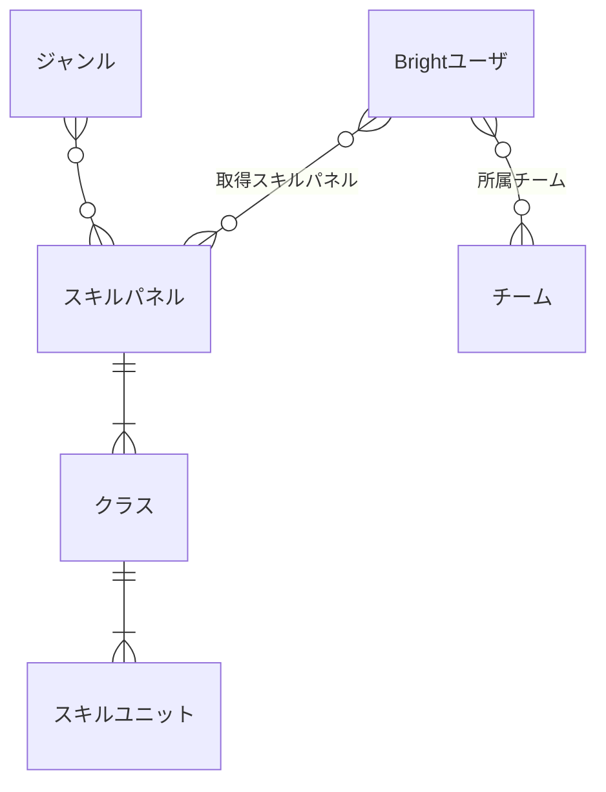

# 概念データモデル

[12-Bright要件定義書②機能要件（概念データ構造、ジョブ階層）](https://docs.google.com/spreadsheets/d/1-MhX-jKPiplTCU3QrPsLUhzutxiXfkbVxwLA0wImA9s/edit#gid=1018705294)をもとに概念データモデルどうしの関係を図式化

```mermaid
erDiagram
  "Brightユーザ" }o--o{ "スキルパネル" : "取得スキルパネル"
  "Brightユーザ" }o--o{ "チーム" : "所属チーム"
  "スキルパネル" ||--|{ "クラス" : ""
  "クラス" ||--|{ "スキルユニット" : ""
  "ジャンル" }o--o{ "スキルパネル" : ""
```
