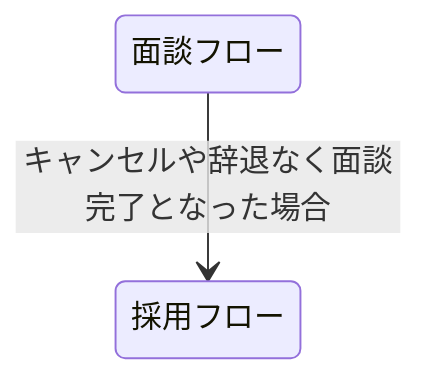
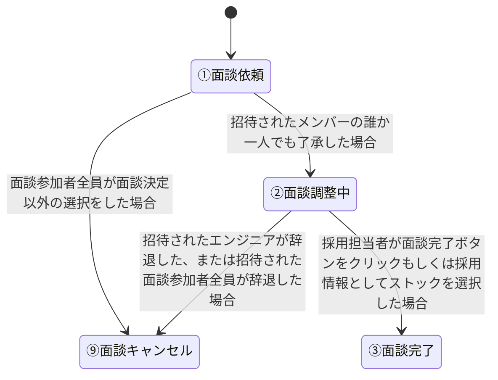
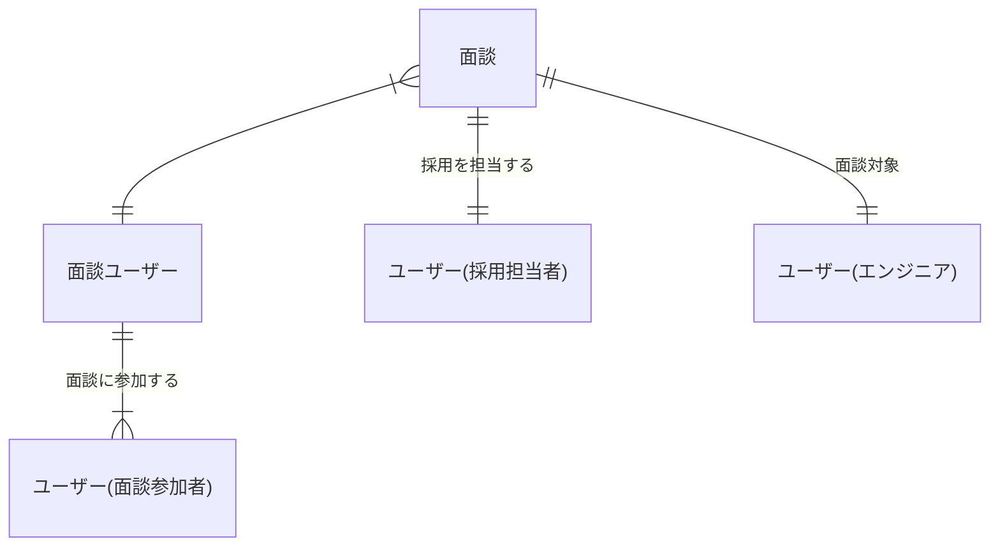
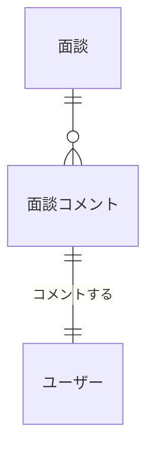
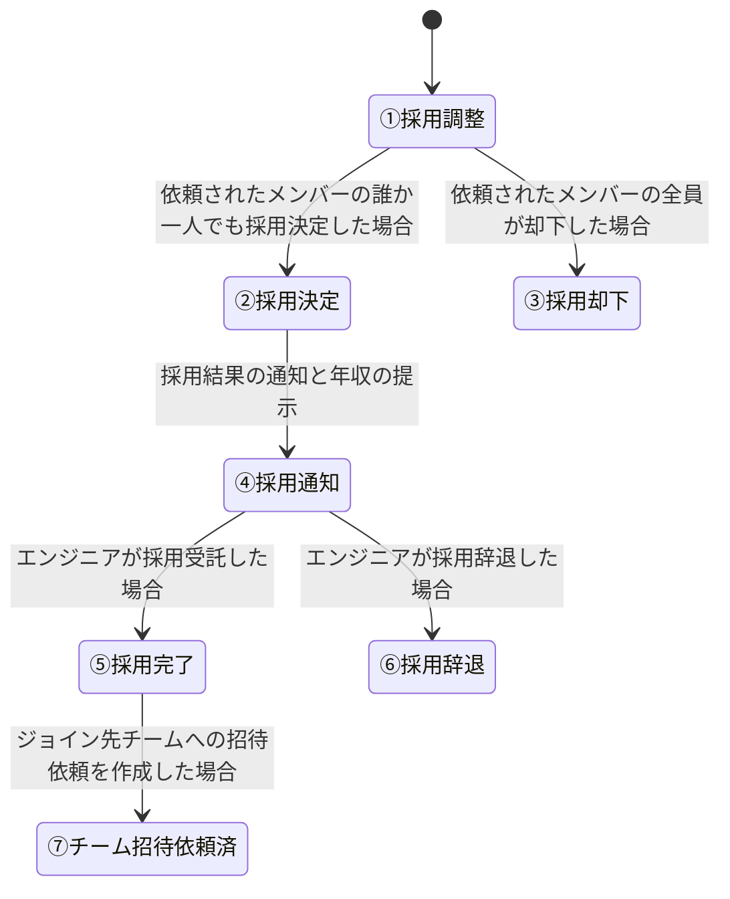
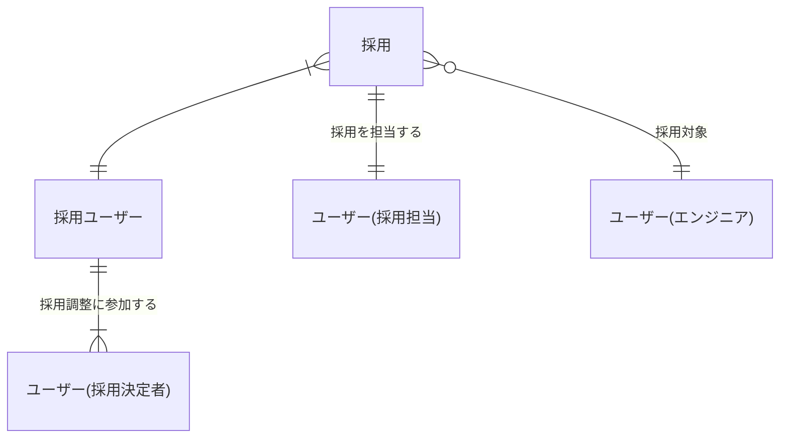
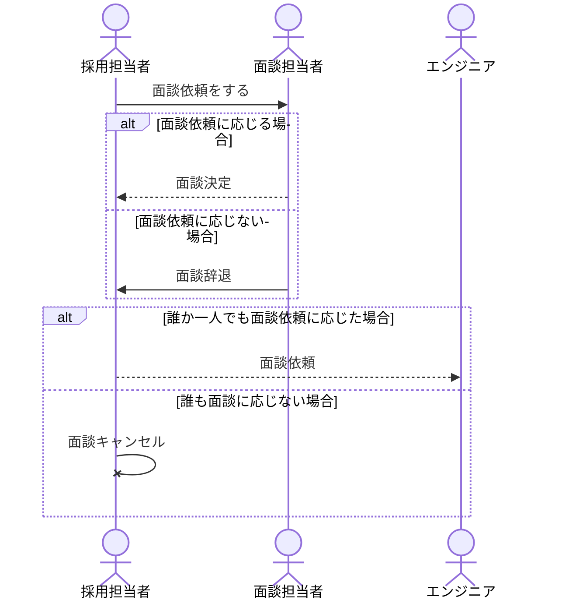

# 採用と面談

Bright上での面談と採用フローに関する概念を扱う

## 関係するシート

- 7.採用担当者がエンジニアを探す

## 関連するアクター

- 採用担当者 ・・・　採用活動をおこなうBrightユーザー。エンジニアの検索、面談依頼を行う本フローでの主体的に立ち回るアクター。採用活動を行うには人材チームの所属している必要がある。
- エンジニア　・・・　採用される対象となるBrightユーザー。採用担当者からの面談依頼をうけて、採用面談を受ける。
- 面談参加者　・・・　面談の評価者として面談への参加依頼を受けたBrightユーザー。採用担当者からの面談依頼をうけて、対象エンジニアの面談に参加する。
- 採用決定者　・・・　採用後のジョイン先として採用決定の判断を行うBrightユーザー。採用担当者からの採用調整依頼をうけて、対象エンジニアの採用調整に参加する。

## 面談と採用

面談から採用までの流れは主に面談依頼から面談の完了までのフローと、面談完了後実際の採用に関する調整フローの２段階に分かれる。

## 面談フロー

採用担当者が採用候補となるエンジニアを匿名状態で検索、対象に対する面談依頼を作成することで面談調整が開始する。

- [面談フロー drow.io](https://app.diagrams.net/#G1vr9ZeQJEJ8zNLrk4dxZd9vd_oIHZkyQf)

面談フローの状態遷移は以下となる。

- 面談は一人の採用担当者によって作成、管理される。
- 面談は一人のエンジニアを対象とする。
- 面談には一人以上複数人の面談参加者が参加する。

### 面談調整中のコメント

- 面談調整中には関連しいてるユーザー全員がコメントを登録することができる。
- コメントには画像、ファイルを添付することができる。
- コメントは自由文言だが、ハンドル名、メールアドレスなど直接連絡先を交換する文言を禁止する。

## 採用フロー

面談結果が面談完了の場合、続いて採用調整を始めることができる。

- [採用フロー drow.iod](https://app.diagrams.net/#G1vr9ZeQJEJ8zNLrk4dxZd9vd_oIHZkyQf#%7B%22pageId%22%3A%225x40QaTA2UGlJ7-TxQPW%22%7D)

面談フローの状態遷移は以下となる。

- 採用は面談の後続フローとしては面談フローを作成したユーザーと同一の採用担当者によって作成、管理される。
- 採用は面談フローの対象と同一の一人のエンジニアを対象とする。
- 採用には一人以上複数人の採用決定者が参加する。

## チームへの招待

採用完了後、採用担当者はジョインするチームを複数選択し、チーム管理者に招待依頼を送る。
チームの招待に関しては通常のチーム招待と同一のデータモデルを使用する為、[ユーザーとチーム](./users.md)参照

# 気になっている点

- 面談依頼の時点で面談担当者全員が自体した場合、採用担当者単独で面談に進むことはできない？(採用担当者=面談担当者はできない？)

- チームを定義した時の条件では課金ユーザーで有効になるのは人材チームの作成権のみ、人材機能を利用できるかどうかは人材チームに所属するか否かできまる。トライアルのダイアログで人材チームの作成フラグをたてにいってるが、人材チームを作成していないので、人材機能は使用できない

https://docs.google.com/spreadsheets/d/161ai6d8-26adTub9nlOtpVAfTmPt9NQp4--q68G0WZo/edit#gid=1338246148&range=I114

- ジョイン先が複数えらべるのに採用年収はひとつ？
- 全般的に途中でモーダルを閉じた場合に復旧する導線がない
- 面談中はチャットが表示されるが、採用では該当チャットが表示されない。年収の提示フェーズ以降ではメッセージのやり取りができない？
- 年収は副業も含めての収入なので年俸がただしいのでわ
- 面談の参加者、採用の決定者、招待先のチーム管理者はそれぞれ別に定義できる？

# 以下は後で消す(marmaindで頑張ったけど見ずらかったのでdrow.ioで再作成)

