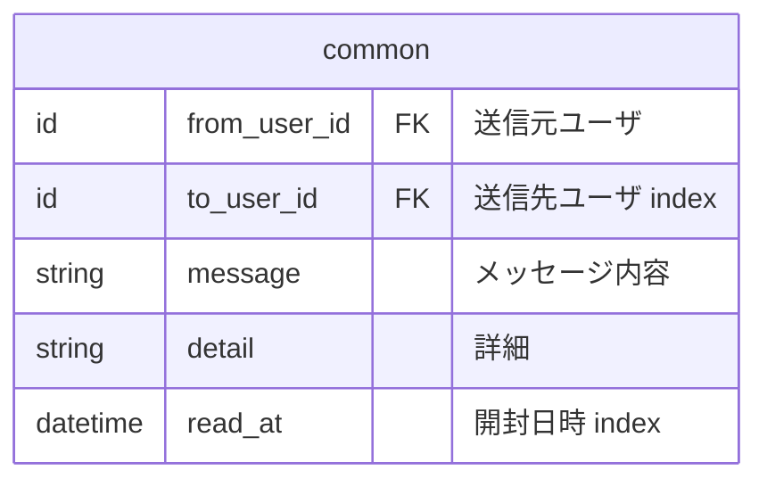
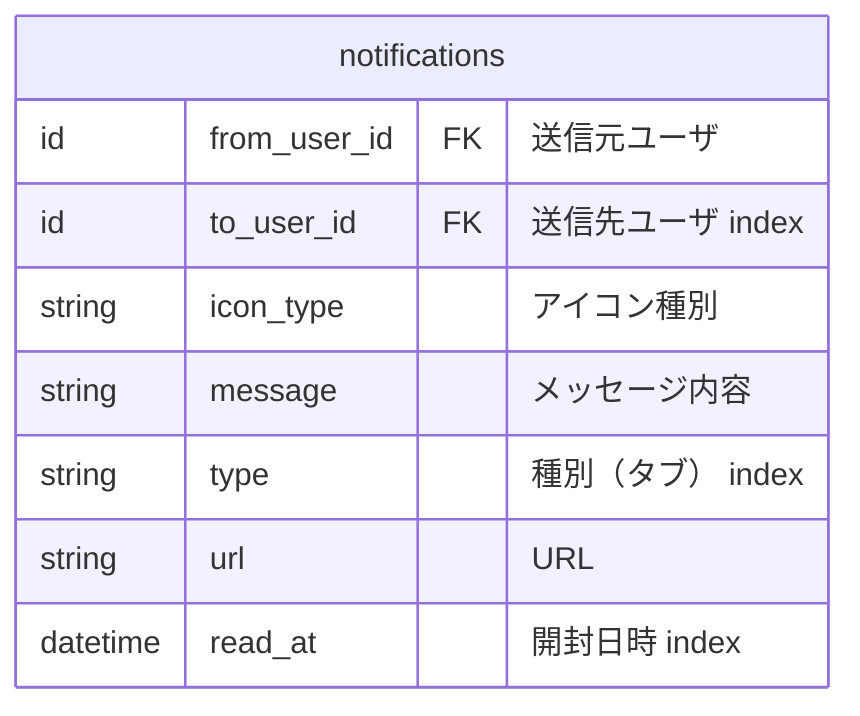

## 通知テーブル
前提事項
- 通知はどの種類でも共通仕様項目を実装する
  - 取得時に共通のルールでデータを取得する為

共通項目

```mermaid
erDiagram
  common {
    id from_user_id	FK "送信元ユーザ"
    id to_user_id	FK "送信先ユーザ index"
    string message	"メッセージ内容"
    string detail	"詳細"
    datetime read_at "開封日時 index"
  }
```

旧通知テーブル

```mermaid
erDiagram
  notifications {
    id from_user_id	FK "送信元ユーザ"
    id to_user_id	FK "送信先ユーザ index"
    string icon_type	"アイコン種別"
    string message	"メッセージ内容"
    string type	"種別（タブ） index"
    string url "URL"
    datetime read_at "開封日時 index"
  }
```
