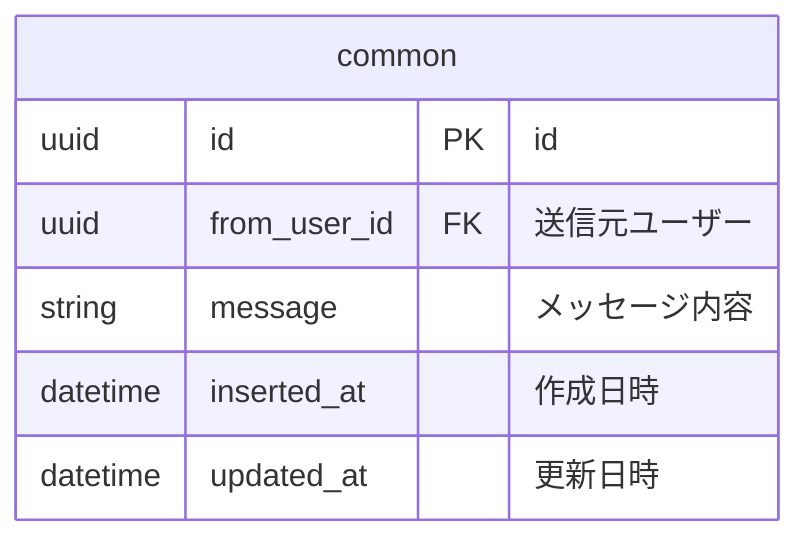
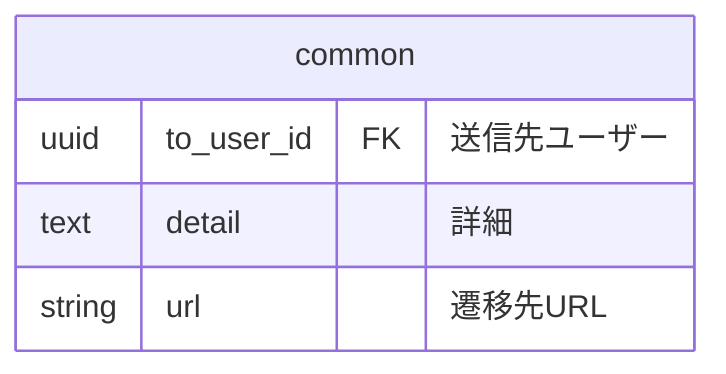
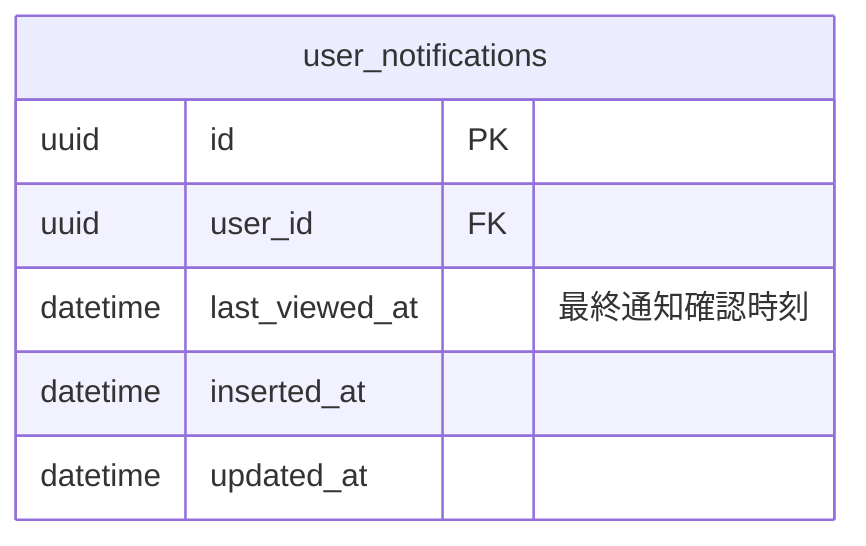
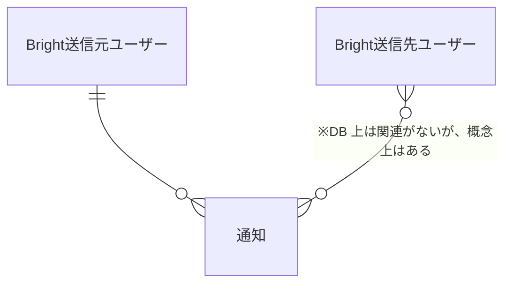
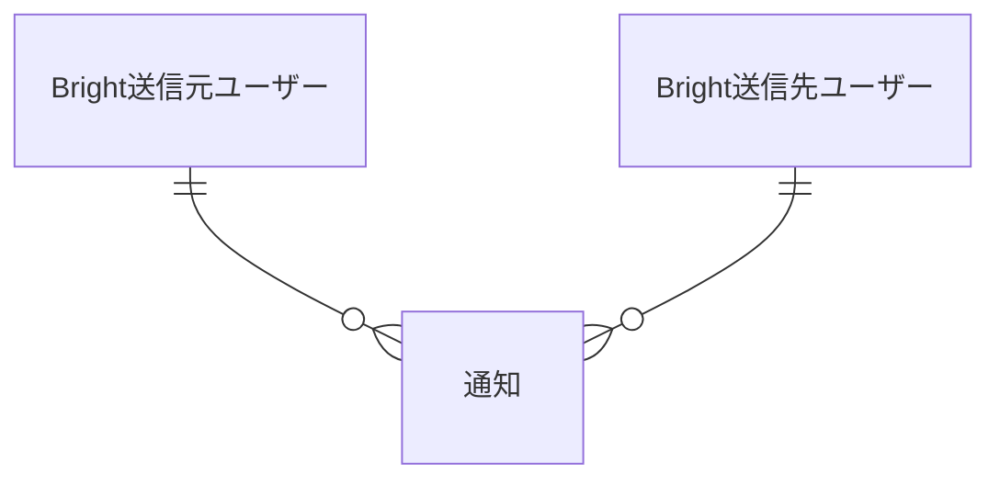
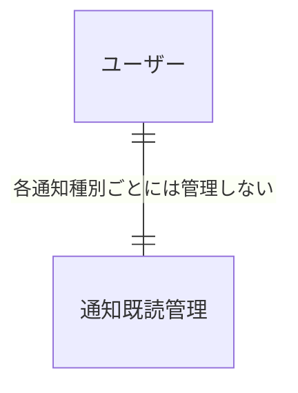
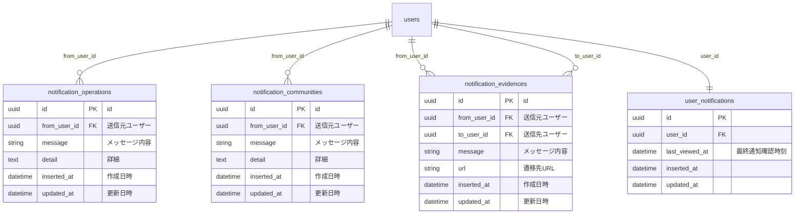

# 通知

Bright にはユーザーへの通知機能がある。
本資料では通知の概要と ER 図を記載する。

## 概要

システムから何らかのトリガーがあると通知が送信される。

ユーザーはヘッダーにあるベルアイコンを確認すると通知の種類を確認できる。

未読の通知がある場合は新着通知バッチがベルアイコンの上部に表示され、ベルアイコンをクリックすると既読になりバッチが消える。

ヘッダーからリンクを飛ぶと通知一覧から通知を確認できる。

通知ごとに固有のアクション（MA ツール側の API を叩くなど）がある場合がある。

## 通知固有アクション

- 運営からの通知
  - 特になし
- コミュニティからの通知
  - MA ツール側の API を叩いてユーザーがコミュニティへの参加を行う
- 学習メモからの通知
  - ヘルプ対象の学習メモに誘導する

## API

以下の通知は運用で使用したいので CRUD API を作成

- 運営からの通知
- コミュニティからの通知

## DB 設計

### 各通知種別の設計方針

各通知種別（運営・コミュニティ...etc）ごとにテーブルを持つ。

１テーブルに集約しない理由は以下。

- 基本的には各通知種別ごとに出すため
  - テーブルが分かれていた方が検索効率が良い
- 各通知種別ごとに必要な要件が微妙に違うので共通化に向いていない
  - 例: 運営からの通知は通知対象ユーザーが全ユーザーであるので to_user_id が不要
  - 各通知種別ごとに固有のアクション（MA ツール側の API を叩くなど）がある場合がある
- 全通知を網羅する機能を現時点で予定していない
  - 仮に必要になっても全テーブルを検索すれば最悪出せる

ただしデータは分割するが、ロジックはなるべく集約する。

具体的には `Bright.Notifications` にロジックを集約し、パターンマッチでロジックの分岐を表現する。

### 通知既読管理の設計方針

通知の既読管理用のテーブルを用意する。なお、通知種別ごとに既読管理はせず、ユーザーに対する全通知に対して一括で既読管理する。

まず、通知を作成するときに既読ステータスを更新する設計（いわゆる Push 型）にはしない。

ユーザー数が増加すると、運営やコミュニティ通知のような「全ユーザー一斉通知」時に大量の insert or update が発生し、将来的に性能課題を抱えるおそれがあるため。

そのため、各ユーザーが既読ステータスを更新する設計（いわゆる Pull 型）とする。

具体的にはユーザーごとに、最終通知確認時刻を管理する。

各通知種別に対して、最終通知時刻以降に更新された通知があれば未読と判定する。

未読時に通知を確認したタイミングで最終通知時刻を更新する。

### 各通知種別ごとのテーブルの共通カラム

以下は、通知によって必要な場合に加える。原則として同じ命名とすること。

### 各通知種別ごとのインデックス設計

- to_user_id にインデックスをつける
  - 通知対象ユーザーに絞り込んで通知を出すため
- updated_at にインデックスをつける
  - 通知の新着管理で特定日付以降の通知レコードを取得するため
  - to_user_id がある場合には [to_user_id, updated_at] の複合インデックスをつける

### 通知既読管理のテーブル設計

### 通知既読管理のインデックス設計

- user_id にインデックスをつける
  - ユーザーごとに既読管理するため

## 通知概念図

### 各通知種別

- 運営
- コミュニティ

- 学習メモ

### 通知既読管理

## スキーマ

## 新規通知実装の流れ

- 本ドキュメントを修正する
- `router.ex` にルーティングを追加する
  - 例: `live "/notifications/operations", NotificationLive.Operation, :index`
- テーブルをマイグレーションする
  - インデックスを貼るのを忘れずに
- `BrightWeb.NotificationLive.NotificationHeaderComponent` を修正する
  - 主に `notification_list/2`
  - `BrightWeb.NotificationLive.NotificationHeaderComponentTest` を修正する
- コンポーネントを実装する
  - 例: `BrightWeb.NotificationLive.Operation`
    - `Bright.Notifications.list_notification_by_type/3` に追加した通知のパターンを実装する
    - `Bright.Notifications.has_unread_notification?/1` に追加した通知のパターンを実装する
    - `Bright.NotificationsTest` を修正する
  - コンポーネントのテストを追加する
    - 例: `BrightWeb.NotificationLive.OperationTest` を修正する
