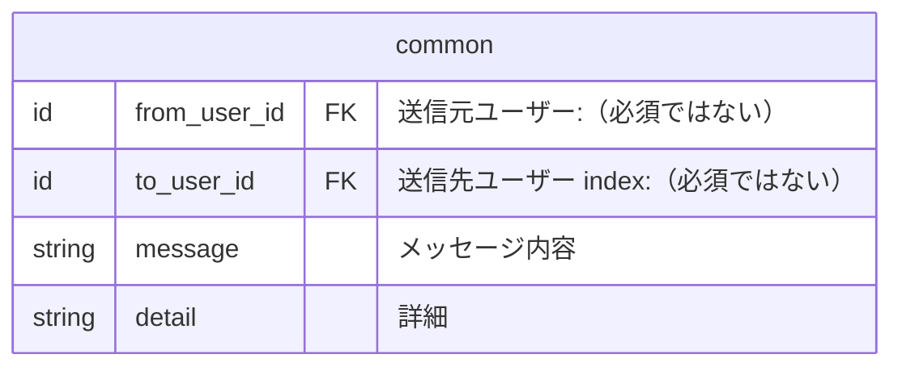

## 通知テーブル
前提事項
- 通知はどの種類でも共通仕様項目を実装する
 - 取得時に共通のルールでデータを取得する為

### 共通項目



## 重要な連絡　ER図
```mermaid
erDiagram
  "Brightユーザー" ||--o{ "通知_チーム招待" : ""
  "通知_チーム招待" ||--|| "Brightユーザー" : ""

  "Brightユーザー" ||--o{ "通知_デイリー" : ""
  "Brightユーザー" ||--o{ "通知_ウイークリー" : ""

  "Brightユーザー" ||--o{ "通知_採用の調整" : ""
  "通知_採用の調整" ||--|| "Brightユーザー" : ""

  "Brightユーザー" ||--o{ "通知_スキルパネル更新" : ""
  "通知_運営"

``````

### 重要な連絡 テーブル
```mermaid
erDiagram
  "users" ||--o{ "notification_team_invitations" : ""
  "notification_team_invitations" ||--|| "users" : ""

  "users" ||--o{ "notification_dailies" : ""
  "users" ||--o{ "notification_weeklies" : ""

  "users" ||--o{ "notification_recruitment_coordinations" : ""
  "notification_recruitment_coordinations" ||--|| "users" : ""

  "users" ||--o{　"notification_skill_panel_updates"　: ""
  "notification_operations"

  notification_team_invitations {
    id from_user_id	FK "送信元ユーザー"
    id to_user_id	FK "送信先ユーザー index"
    string message	"メッセージ内容"
    string detail	"詳細"
  }
  
  notification_dailies {
    id to_user_id	FK "送信先ユーザー index"
    string message	"メッセージ内容"
    string detail	"詳細"
  }

  notification_weeklies {
    id to_user_id	FK "送信先ユーザー index"
    string message	"メッセージ内容"
    string detail	"詳細"
  }

  notification_recruitment_coordinations {
    id from_user_id	FK "送信元ユーザー"
    id to_user_id	FK "送信先ユーザー index"
    string message	"メッセージ内容"
    string detail	"詳細"
  }

  notification_skill_panel_updates {
    id to_user_id	FK "送信先ユーザー index"
    string message	"メッセージ内容"
    string detail	"詳細"
  }

  notification_operations {
    string message	"メッセージ内容"
    string detail	"詳細"
  }
  
```


## さまざまな人たちとの交流 ER図

```mermaid
erDiagram
  "Brightユーザー" ||--o{ "通知_スキルアップ" : ""
  "通知_スキルアップ" ||--|| "Brightユーザー" : ""

  "Brightユーザー" ||--o{ "通知_1on1のお誘い" : ""
  "通知_1on1のお誘い" ||--|| "Brightユーザー" : ""

  "Brightユーザー" ||--o{ "通知_推し活" : ""
  "通知_推し活" ||--|| "Brightユーザー" : ""

  "Brightユーザー" ||--o{ "通知_所属チーム" : ""
  "通知_所属チーム" ||--|| "Brightユーザー" : ""

  "Brightユーザー" ||--o{ "通知_気になる" : ""
  "通知_気になる" ||--|| "Brightユーザー" : ""

  "Brightユーザー" ||--o{ "通知_運営公式" : ""

``````

## さまざまな人たちとの交流 テーブル

```mermaid
erDiagram
  "users" ||--o{ "notification_skill_ups" : ""
  "notification_skill_ups" ||--|| "users" : ""

  "users" ||--o{ "notification_1on1_invitations" : ""
  "notification_1on1_invitations" ||--|| "users" : ""

  "users" ||--o{ "notification_promotions" : ""
  "notification_promotions" ||--|| "users" : ""

  "users" ||--o{ "notification_your_teams" : ""
  "notification_your_teams" ||--|| "users" : ""

  "users" ||--o{ "notification_intriguings" : ""
  "notification_intriguings" ||--|| "users" : ""

  "users" ||--o{ "notification_official_teams" : ""

  notification_skill_ups {
    id from_user_id	FK "送信元ユーザー"
    id to_user_id	FK "送信先ユーザー index"
    string message	"メッセージ内容"
    string detail	"詳細"
    boolean congratulate　"祝福する"
  }

  notification_1on1_invitations {
    id from_user_id	FK "送信元ユーザー"
    id to_user_id	FK "送信先ユーザー index"
    string message	"メッセージ内容"
    string detail	"詳細"
    string accept_status "受入ステータス： enum（acceptance、rejection）"
  }

  notification_promotions {
    id from_user_id	FK "送信元ユーザー"
    id to_user_id	FK "送信先ユーザー index"
    string message	"メッセージ内容"
    string detail	"詳細"
  }

  notification_your_teams {
    id from_user_id	FK "送信元ユーザー"
    id to_user_id	FK "送信先ユーザー index"
    string message	"メッセージ内容"
    string detail	"詳細"
  }

  notification_intriguings {
    id from_user_id	FK "送信元ユーザー"
    id to_user_id	FK "送信先ユーザー index"
    string message	"メッセージ内容"
    string detail	"詳細"
  }

  notification_official_teams {
    id to_user_id	FK "送信先ユーザー index"
    string message	"メッセージ内容"
    string detail	"詳細"
    boolean participation "参加状況 true: 参加、 false: 脱退する"
  }

``````


## 旧通知テーブル 【廃止予定】

```mermaid
erDiagram
  notifications {
    id from_user_id	FK "送信元ユーザー"
    id to_user_id	FK "送信先ユーザー index"
    string icon_type	"アイコン種別"
    string message	"メッセージ内容"
    string type	"種別（タブ） index"
    string url "URL"
    datetime read_at "開封日時 index"
  }
```
