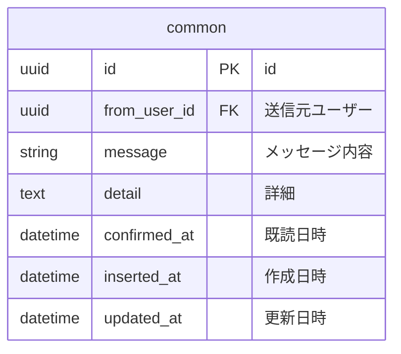
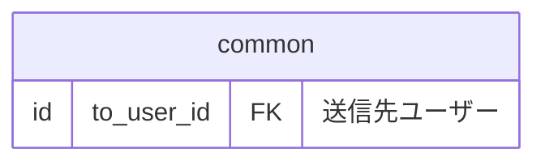
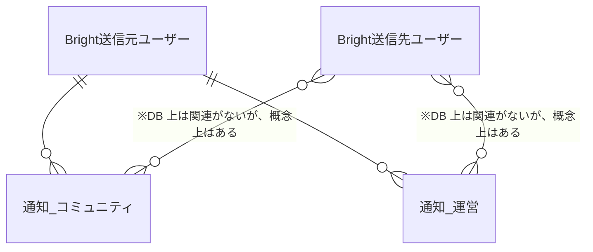
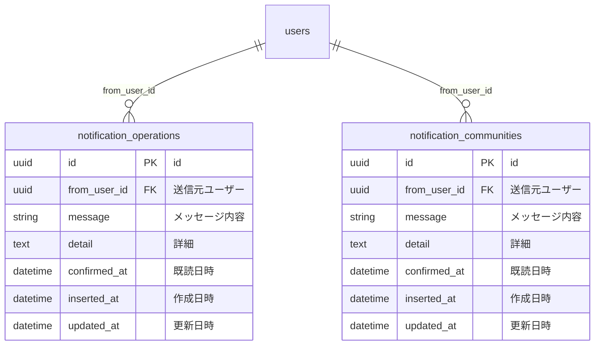

# 通知

Bright にはユーザーへの通知機能がある。
本資料では通知の概要と ER 図を記載する。

## 概要

システムから何らかのトリガーがあると通知が送信される。

ユーザーはヘッダーにあるベルマークを確認すると通知の種類と未読数を確認できる。

ヘッダーからリンクを飛ぶと通知一覧から通知を確認できる。

通知を確認したらその通知は既読状態になる。

通知ごとに固有のアクション（MA ツール側の API を叩くなど）がある場合がある。

## 通知固有アクション

- 運営からの通知
  - 特になし
- コミュニティからの通知
  - MA ツール側の API を叩いてユーザーがコミュニティへの参加を行う

## API

以下の通知は運用で使用したいので CRUD API を作成

- 運営からの通知
- コミュニティからの通知

## DB 設計

### 設計方針

各通知種別（運営・コミュニティ...etc）ごとにテーブルを持つ。

１テーブルに集約しない理由は以下。

- 基本的には各通知種別ごとに出すため
  - テーブルが分かれていた方が検索効率が良い
- 各通知種別ごとに必要な要件が微妙に違うので共通化に向いていない
  - 例: 運営からの通知は通知対象ユーザーが全ユーザーであるので to_user_id が不要
  - 各通知種別ごとに固有のアクション（MA ツール側の API を叩くなど）がある場合がある
- 全通知を網羅する機能を現時点で予定していない
  - 仮に必要になっても全テーブルを検索すれば最悪出せる

ただしデータは分割するが、ロジックはなるべく集約する。

具体的には `Bright.Notifications` にロジックを集約し、パターンマッチでロジックの分岐を表現する。

### 全テーブルで共通の内容

なお送信対象ユーザーの指定が必要な通知の場合は上記に加えて to_user_id を含める。

### インデックス設計

- to_user_id, confirmed_at の複合インデックスをつける（この順序で指定）
  - 通知ヘッダーで未読数をバッチつけるため
  - to_user_id を先に指定することで to_user_id 単体にもインデックス効かせる
    - 通知対象ユーザーに絞り込んで通知を出すため
  - ※ to_user_id がないテーブルの場合は confirmed_at 単体にインデックスをつける

## 通知概念図

## 新規通知実装の流れ

- 本ドキュメントを修正する
- `router.ex` にルーティングを追加する
  - 例: `live "/notifications/operations", NotificationLive.Operation, :index`
- テーブルをマイグレーションする
  - インデックスを貼るのを忘れずに
- `BrightWeb.NotificationLive.NotificationHeaderComponent` を修正する
  - 主に `notification_list/2`
    - `Bright.Notifications.list_unconfirmed_notification_count/1` に追加した通知のパターンを実装する
      - `Bright.NotificationsTest` を修正する
  - `BrightWeb.NotificationLive.NotificationHeaderComponentTest` を修正する
- コンポーネントを実装する
  - 例: `BrightWeb.NotificationLive.Operation`
    - `Bright.Notifications.list_notification_by_type/3` に追加した通知のパターンを実装する
    - `Bright.NotificationsTest` を修正する
  - コンポーネントのテストを追加する
    - 例: `BrightWeb.NotificationLive.OperationTest` を修正する
