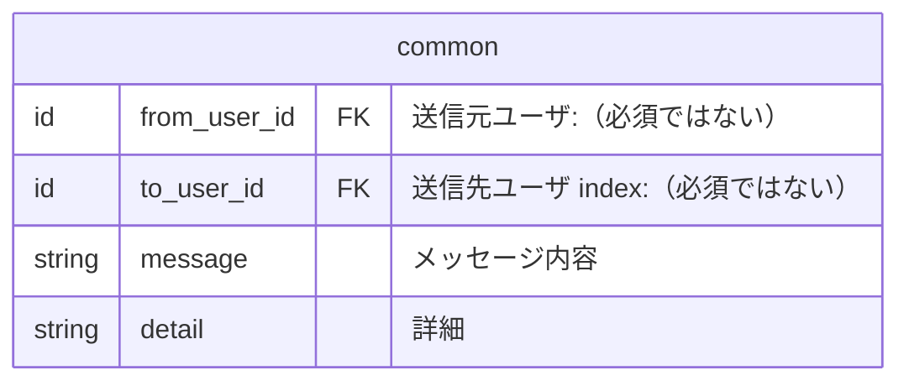

## 通知テーブル
前提事項
- 通知はどの種類でも共通仕様項目を実装する
 - 取得時に共通のルールでデータを取得する為

### 共通項目



## 重要な連絡　ER図
```mermaid
erDiagram
  "Brightユーザー" ||--o{ "通知_チーム招待" : ""
  "通知_チーム招待" ||--|| "Brightユーザー" : ""

  "Brightユーザー" ||--o{ "通知_デイリー" : ""
  "Brightユーザー" ||--o{ "通知_ウイークリー" : ""

  "Brightユーザー" ||--o{ "通知_採用の調整" : ""
  "通知_採用の調整" ||--|| "Brightユーザー" : ""

  "通知_スキルパネル更新"
  "通知_運営"

``````

### 重要な連絡　テーブル
```mermaid
erDiagram
  "users" ||--o{ "notification_team_invitations" : ""
  "notification_team_invitations" ||--|| "users" : ""

  "users" ||--o{ "notification_dailies" : ""
  "users" ||--o{ "notification_weeklies" : ""

  "users" ||--o{ "notification_recruitment_coordinations" : ""
  "notification_recruitment_coordinations" ||--|| "users" : ""

  "notification_skill_panel_updates"
  "notification_operations"
```


## さまざまな人たちとの交流 ER図

```mermaid
erDiagram
  "Brightユーザー" ||--o{ "通知_スキルアップ" : ""
  "通知_スキルアップ" ||--|| "Brightユーザー" : ""

  "Brightユーザー" ||--o{ "通知_1on1のお誘い" : ""
  "通知_1on1のお誘い" ||--|| "Brightユーザー" : ""

  "Brightユーザー" ||--o{ "通知_推し活" : ""
  "通知_推し活" ||--|| "Brightユーザー" : ""

  "Brightユーザー" ||--o{ "通知_所属チーム" : ""
  "通知_所属チーム" ||--|| "Brightユーザー" : ""

  "Brightユーザー" ||--o{ "通知_気になる" : ""
  "通知_気になる" ||--|| "Brightユーザー" : ""

  "Brightユーザー" ||--o{ "通知_運営公式" : ""

``````


## 旧通知テーブル 【廃止予定】
```mermaid
erDiagram
  notifications {
    id from_user_id	FK "送信元ユーザ"
    id to_user_id	FK "送信先ユーザ index"
    string icon_type	"アイコン種別"
    string message	"メッセージ内容"
    string type	"種別（タブ） index"
    string url "URL"
    datetime read_at "開封日時 index"
  }
```
