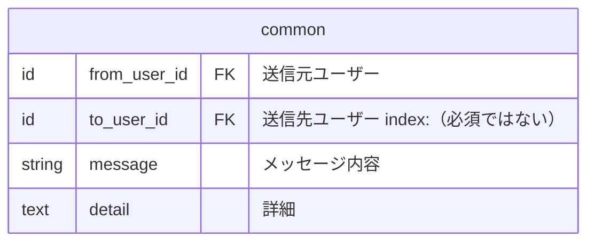
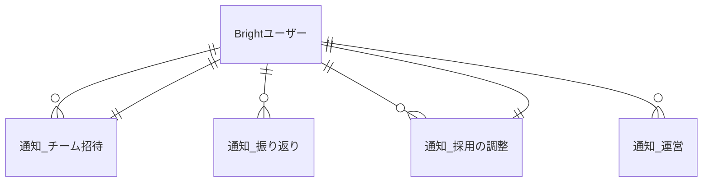
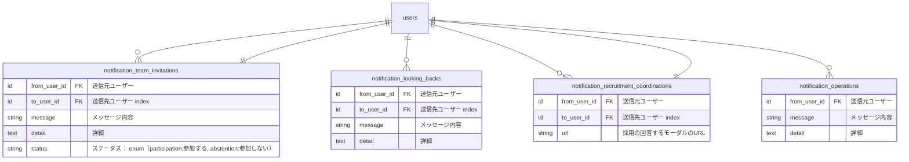
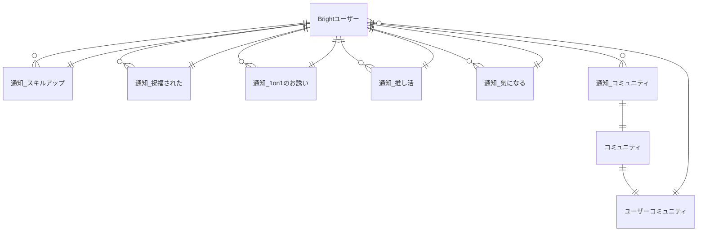
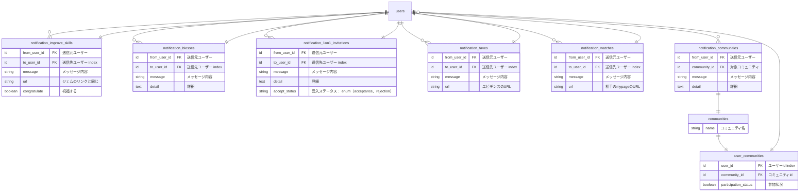

## 通知テーブル

前提事項

- 通知はどの種類でも共通仕様項目を実装する
- 取得時に共通のルールでデータを取得する為

### 共通項目



## 重要な連絡　 ER 図



### 重要な連絡 テーブル



## さまざまな人たちとの交流 ER 図



## さまざまな人たちとの交流 テーブル



## 通知と同時に行われる処理

```
重要な連絡
　・チーム招待
　　「参加する」「参加しない」
　　　（チーム招待側の処理でメールを送信しているため制御外）
　・採用の調整　※面談調整の方で別枠化する可能性があるため今は暫定
　　「確認する」
　　　└通知（DB）追加時にメールも送信する
　　　└専用のモーダル（回答するモーダル）
　　　　└詳細は不要
　　　└URL
　・スキルパネル更新
　　「内容を見る」
　　　└通知（DB）追加時にメールも送信する（「成長グラフを見る」をナビゲーションを案内）
　・運営　※CRUD API
　　「内容を見る」
　　　└通知（DB）追加時にメールも送信する
　　　※「デイリー」「ウイークリー」もこのタブに含む

さまざまな人たちとの交流
　・スキルアップ ※スキルアップの方で別枠化する可能性があるため今は暫定
　　「スキルを確認」「祝福する」
        ｜　　　　　　　└　相手の祝福されたテーブルに追加
　　　　└ジェムのリンクと同じ
　・祝福された
　　「内容を見る」（テーブルを作る　共通と同じ）
　・1on1のお誘い
　　「受ける」「断る」
　　　└通知（DB）追加時にメールも送信する
　・推し活
　　「確認する」
　　　└エビデンスに飛ぶ
　　　└URL
　・気になる
　　「相手を見る」
　　　└URL（詳細不要）
　・コミュニティ　※CRUD API
　　「内容を見る」　ラベル：「参加中」「未参加」
　　　　└「参加する」「脱退する」のトグル
          └該当ユーザーのuser_communitiesがない場合は 「未参加」扱い
          └「参加する」をクリック時にuser_communitiesがない場合はレコードを作成
          └「脱退」をクリック時にuser_communitiesの参加状況はfalseに変更
　　　　└通知（DB）追加時にメールも送信する
　　　　└運営側のチームのDBにも追加
　　　　
```
