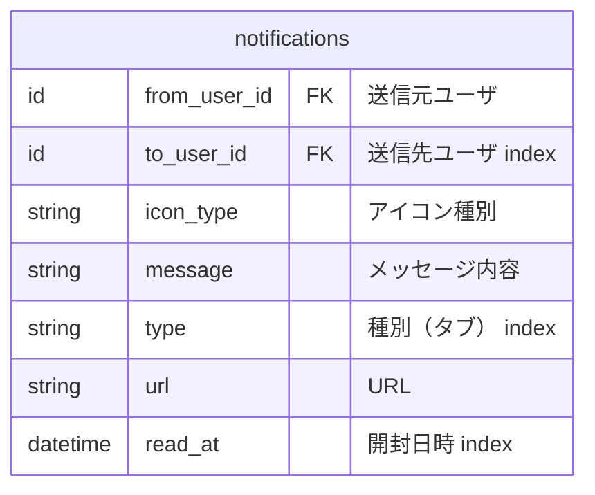

## 通知テーブル
前提事項
- 通知はどの種類でも共通仕様項目を実装する
 - 取得時に共通のルールでデータを取得する為


重要な連絡
```mermaid
erDiagram
  "Brightユーザー" ||--o{ "チーム招待" : ""
  "チーム招待" ||--|| "Brightユーザー" : ""

  "Brightユーザー" ||--o{ "デイリー" : ""
  "Brightユーザー" ||--o{ "ウイークリー" : ""

  "Brightユーザー" ||--o{ "採用の調整" : ""
  "採用の調整" ||--|| "Brightユーザー" : ""

  "スキルパネル更新"
  "運営"

``````
さまざまな人たちとの交流

```mermaid
erDiagram
  "Brightユーザー" ||--o{ "スキルアップ" : ""
  "スキルアップ" ||--|| "Brightユーザー" : ""

  "Brightユーザー" ||--o{ "1on1のお誘い" : ""
  "1on1のお誘い" ||--|| "Brightユーザー" : ""

  "Brightユーザー" ||--o{ "推し活" : ""
  "推し活" ||--|| "Brightユーザー" : ""

  "Brightユーザー" ||--o{ "所属チーム" : ""
  "所属チーム" ||--|| "Brightユーザー" : ""

  "Brightユーザー" ||--o{ "気になる" : ""
  "気になる" ||--|| "Brightユーザー" : ""

  "Brightユーザー" ||--o{ "運営公式" : ""

``````


共通項目
```mermaid
erDiagram
  common {
    id from_user_id	FK "送信元ユーザ:（必須ではない）"
    id to_user_id	FK "送信先ユーザ index:（必須ではない）"
    string message	"メッセージ内容"
    string detail	"詳細"
  }
```


旧通知テーブル 【廃止予定】

