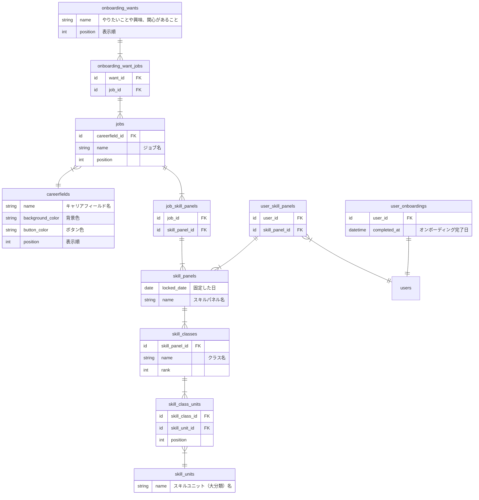

# オンボーディングに関わるテーブル定義案
[行動シナリオ「4. オンボーディングで最初のスキルパネルを選択する」](https://docs.google.com/spreadsheets/d/161ai6d8-26adTub9nlOtpVAfTmPt9NQp4--q68G0WZo/edit#gid=458681671)で必要なテーブルの定義案です。

[figma](https://www.figma.com/file/q9SVY4YWjijOrgsQtJjlD6/Bright?type=design&node-id=627-3632&mode=design&t=aO8asUN6kiZ0xGCq-0) の対象画面は
4-1-1、4-1-2、4-1-3、4-1-4までを範囲にしています。

### テーブル定義案

- `id`, `inserted_at`, `updated_at` は省略
- 新しく定義したいテーブル
  - `onboarding_wants`、`onboarding_want_jobs`、`careerfields`、`jobs`、`job_skill_panels`、`user_onboardings` の6テーブル
- 既に定義案があるテーブル
  - `skill_panels`、`user_skill_panels`、`skill_panels`、`skill_classes`、`skill_class_units`
  - [概念データモデル スキル体系](https://github.com/bright-org/bright/blob/develop/docs/conceptual_schemas/skills.md) にて定義済み

- `onboarding_want_jobs` は、jobsからcareerfieldsを逆引きするために使う。複数同じcareerfieldが引けた場合はユニーク化する。
- `careerfields`、`jobs` はキャリアパスと共有するので、`onboarding_`をプレフィックスとしてつけない。
- `job_skill_panels` はjobsかskill_panelを逆引きするために使う。複数同じskill_panelが引けた場合はユニーク化する。
- オンボーディングではskill_panelsを参照する際、skill_classes.rank=1で引く前提。

