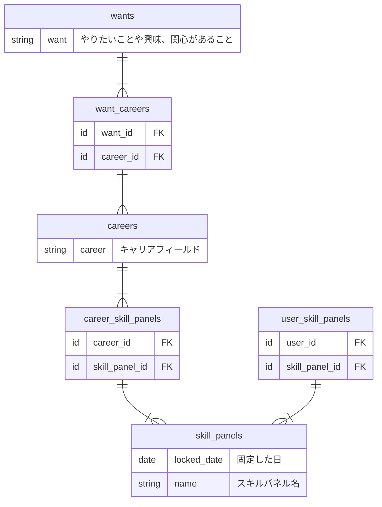

# オンボーディングに関わるテーブル定義案

### テーブル定義案

- `id`, `inserted_at`, `updated_at` は省略

```mermaid
erDiagram
  wants ||--|{ want_careers : ""
  want_careers ||--|{ careers : ""
  careers ||--|{ career_skill_panels : ""
  career_skill_panels ||--|{ skill_panels : ""
  user_skill_panels ||--|{ skill_panels : ""

  wants {
    string want "やりたいことや興味、関心があること"
  }

  want_careers {
    id want_id FK
    id career_id FK
  }

  careers {
    string career "キャリアフィールド"
  }

  career_skill_panels {
    id career_id FK
    id skill_panel_id FK
  }

  skill_panels {
    date locked_date "固定した日"
    string name "スキルパネル名"
  }

  user_skill_panels {
    id user_id FK
    id skill_panel_id FK
  }
```