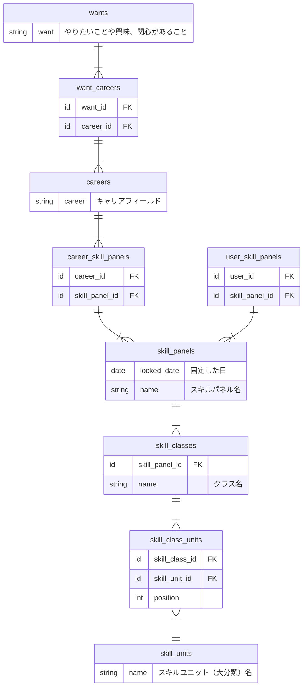

# オンボーディングに関わるテーブル定義案

### テーブル定義案

- `id`, `inserted_at`, `updated_at` は省略
- 新しく定義したいテーブル
  - `wants`、`want_careers`、`careers`、`user_skill_panels` の4テーブル
- 既に定義案があるテーブル
  - `skill_panels`、`user_skill_panels`、`skill_panels`、`skill_classes`、`skill_class_units`
  - [概念データモデル スキル体系](https://github.com/bright-org/bright/blob/develop/docs/conceptual_schemas/skills.md) にて定義済み

