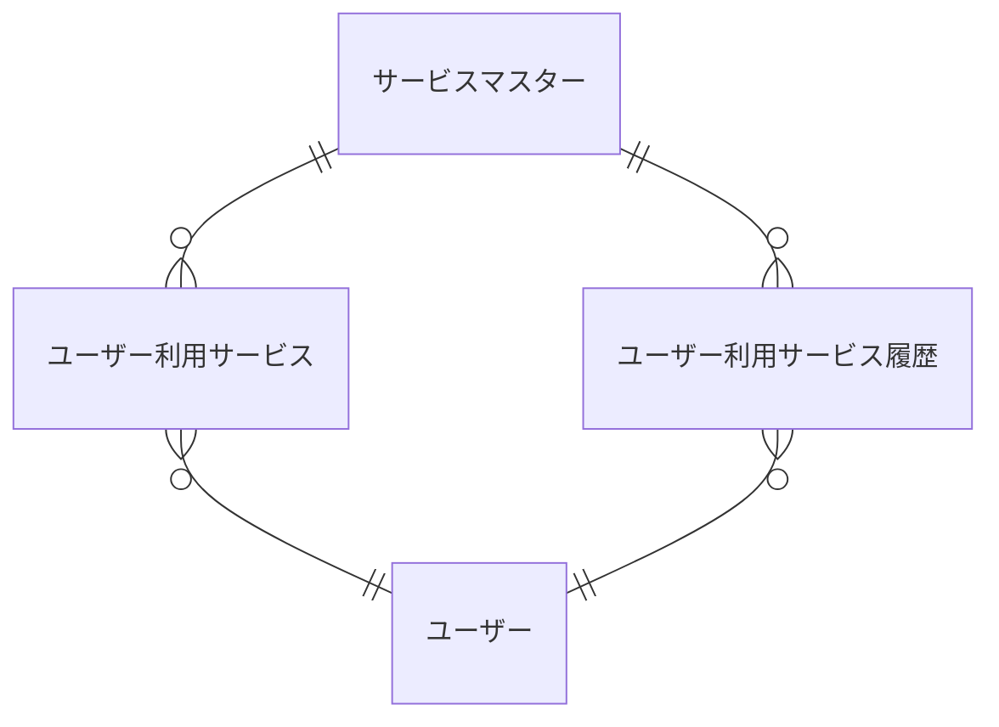
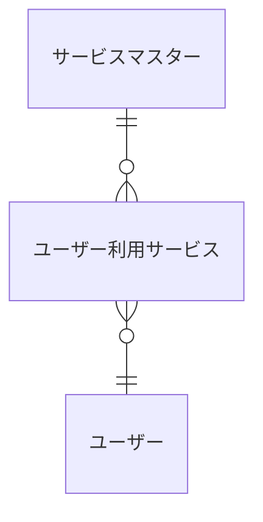
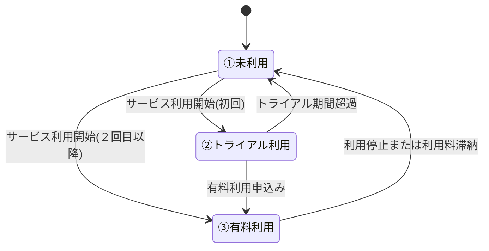
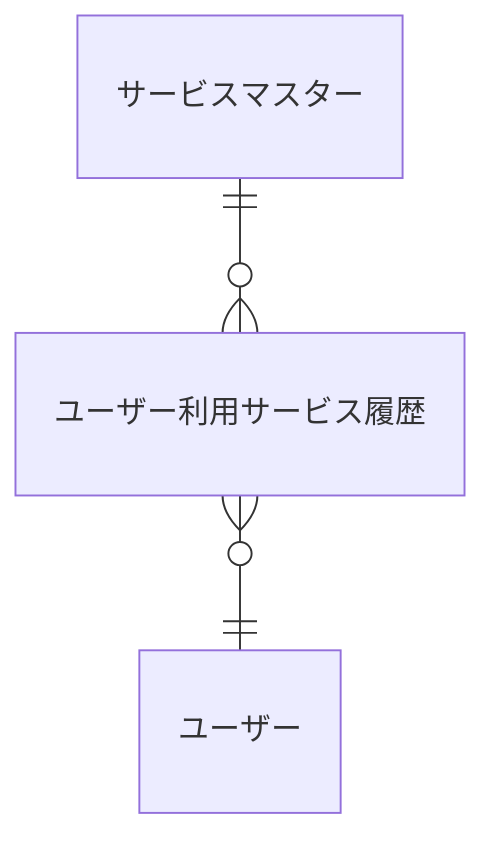

# サービスと利用料の決済

Brightで利用可能な有料サービスメニューとユーザーの利用状況管理、利用料の決済に関する概念を扱う。

## 関係するシート

なし

## 概念ER図（サービスと利用状況）

## 有料サービス

Brightでユーザーが利用可能な機能のうち、請求対象となるものをサービスマスターに定義する。
ユーザーはサービス毎に利用有無を選択でき、利用する機能の合計金額を利用料として前払いにて決済する。

## サービスの状態遷移

ユーザーはサービスメニューからいつでも有料機能を選択し利用開始することができる。
サービス利用直後、一定期間はトライアル利用とし課金対象としない。
トライアルの可否はユーザー、サービス事に判定する。（既にあるサービスでトライアル利用済のユーザーあっても異なるサービスであれば再度トライアル利用できる）

#### ・　①-->②　サービス利用開始(初回)
ユーザーがサービスメニューから該当サービスを選択することで該当サービスが利用可能となる。初回は一定期間トライアル利用となり、課金対象外となる。

#### ・　①-->③　サービス利用開始(２回目以降)
２回目以降、該当サービスに対するトライアル利用はスキップされ、即時有料利用となる。

#### ・　②-->③　有料利用申込み
トライアルトライアル利用中、ユーザーはいつでも有料利用申し込み操作を行うことができる。有料利用申し込みした場合、即時決済が実行され、サービス利用状態は有料利用となる。

#### ・　②-->①　トライアル期間超過
設定されたトライアル期間中に決済が確認できない場合、サービス利用状態は未利用に戻る。(有料申込み操作があっても決済不能の状態では無効)

#### ・　③-->①　利用停止または利用料滞納
ユーザーはいつでもサービス利用停止の申し込みを行うことができる。
決済タイミングにてサービス利用停止が確認された場合、サービス利用状態は未利用に戻る。
また明示的なサービス利用停止申し込みがなくとも、決済タイミングにてサービス利用料の決済が不能な場合、サービス利用状態は未利用に戻る。

※　決済機能が実装されない初期リリース時点においては決済系は運用作業で実施する想定の為、上記状態遷移にはタイムラグが発生する

## サービスの利用履歴とトライアルの利用可否判定

トライアル利用有無の管理や、ユーザーのサービス利用、利用停止状況調査の為、トライアル利用、サービス利用状態を履歴として管理する。
該当ユーザーに該当サービスの利用履歴が存在する場合は２回目以降の利用申し込みと判断しトライアル状態をスキップし、即時有料利用状態とする。

ユーザー利用サービス履歴では以下の項目を管理する。

| 項目 | 内容 |
| ---- | ---- |
| トライアル利用開始日時 | トライアル利用開始時点の日時を設定 |
| トライアル終了予定日時 | トライアル開始時点で算出したトライアル終了予定日時を設定 |
| トライアル利用終了日時 | トライアル利用終了時点の日時を設定 |
| 有料利用開始日 | 有料利用の開始日時設定 |
| 有料利用終了日 | 理由の如何にかかわらず有料利用の終了日時設定 |
| 利用停止事由 | 該当のサービス利用停止(有料申し込みの無い場合のトライアル利用終了または有料利用終了時点)時点での停止事由を記録 (トライアル期限超過 / 利用停止申込み / 滞納自動停止) |

## 有料サービス利用料の決済

Brightの有料サービスへの課金は月次の前払い制とする。
月の最中で有料利用開始した場合も一か月分の利用料が発生する。
また、月中に利用停止の申し込みがあった場合は月末時点まではサービス利用状態を維持し、即時利用停止と残存日数分の返金は行わない。

### 決済タイミング

Brightの決済処理には以下の２パターンが存在する。

#### 月次決済
決済サイクルの初日時点でサービス利用状態のサービス利用料金の合計を一括で決済する。

#### 即時決済
有料利用申し込みの際は当決済サイクル分の利用料をサービス事に追加即時決済する。

## 決済履歴

初期リリース時点では決済機能未実装の為、決済履歴は実装しない。
