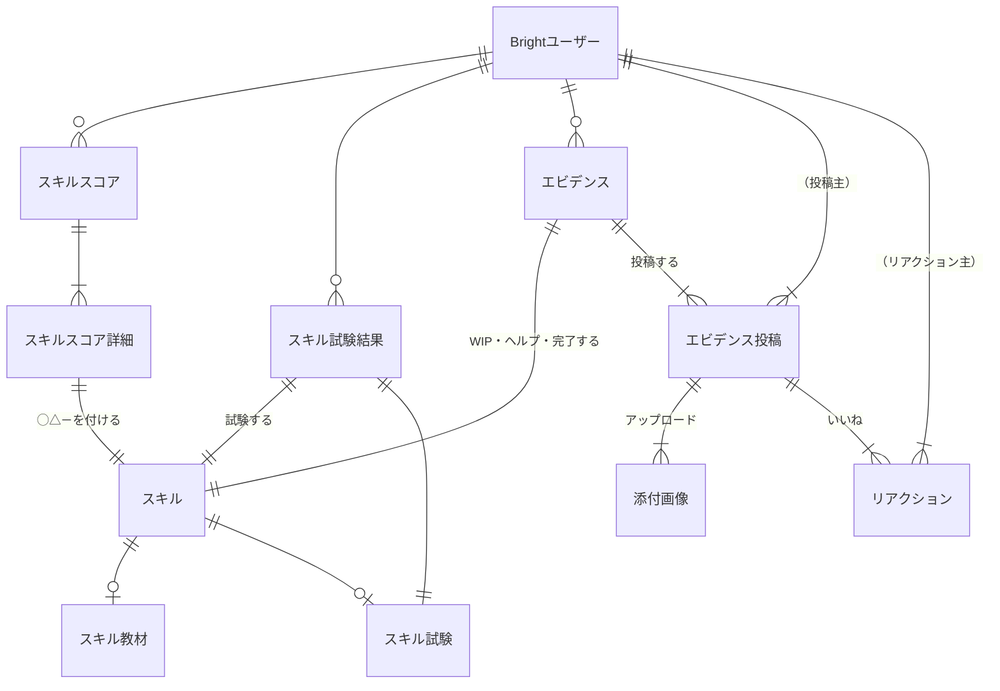

# 概念データモデル

ユーザーとスキルまわり（教材・試験・エビデンス登録）の概念データモデルです。

参考：

- [行動シナリオ：教材・試験・エビデンス登録](https://docs.google.com/spreadsheets/d/161ai6d8-26adTub9nlOtpVAfTmPt9NQp4--q68G0WZo/edit#gid=496055998)

## ER図

### 補足

- エビデンス投稿への添付画像をテーブルとして独立させるかは実装依存
- [スキル、スキルスコア系は別ファイルにあります](./skills.md)

## テーブル

- スキル教材： skill_references
- スキル試験： skill_exams
- エビデンス： skill_evidences
- エビデンス投稿： skill_evidence_posts
- エビデンス投稿リアクション： skill_evidence_reactions

