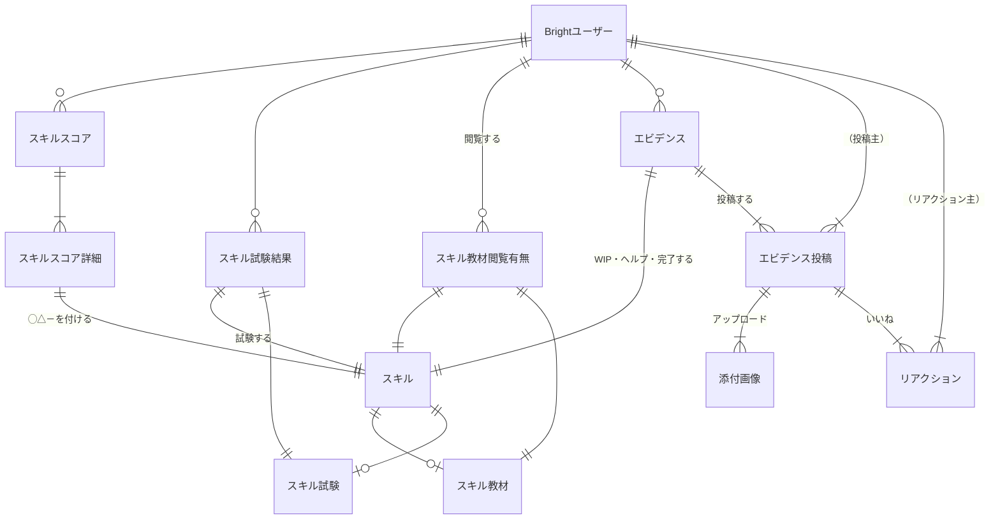
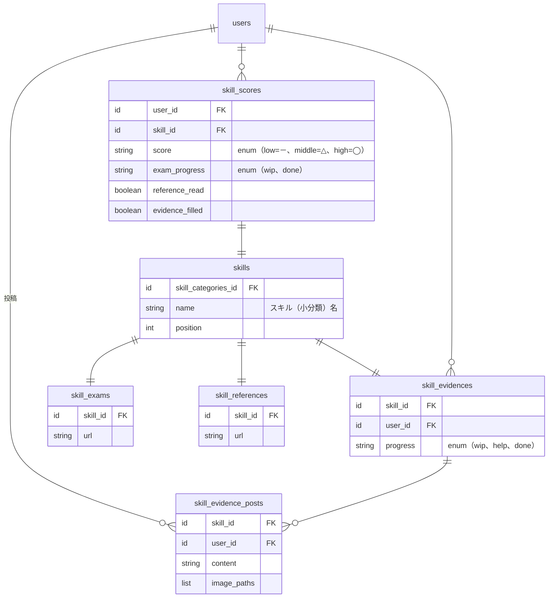

# 概念データモデル

ユーザーとスキルまわり（教材・試験・エビデンス登録）の概念データモデルです。

参考：

- [行動シナリオ：教材・試験・エビデンス登録](https://docs.google.com/spreadsheets/d/161ai6d8-26adTub9nlOtpVAfTmPt9NQp4--q68G0WZo/edit#gid=496055998)

## ER図

### 補足

- エビデンス投稿への添付画像はエビデンスと作成・削除を同一で行うため共通テーブル
- [スキル、スキルスコア系は別ファイルにあります](./skills.md)

### テーブル定義案

備考

- 下記のデータをskill_scoresに保持する
  - スキル試験結果
  - スキル教材閲覧有無
  - エビデンスを一度でも入れたかどうか
    - ※wip/help/doneの詳細ステータスはskill_evidencesがもつ

