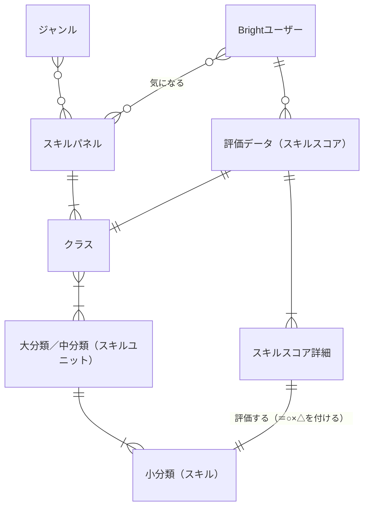
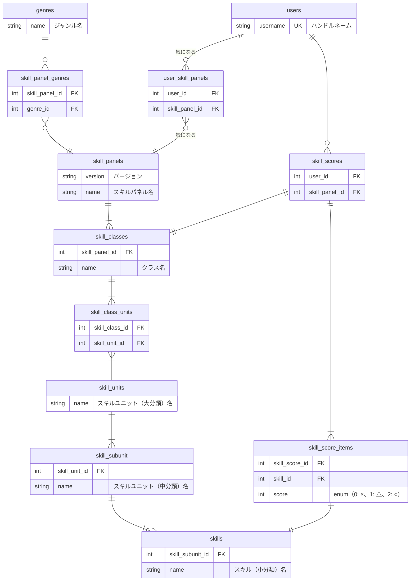

# 概念データモデル

[12-Bright要件定義書②機能要件（概念データ構造、ジョブ階層）](https://docs.google.com/spreadsheets/d/1-MhX-jKPiplTCU3QrPsLUhzutxiXfkbVxwLA0wImA9s/edit#gid=1018705294)をもとに概念データモデルどうしの関係を図式化

## スキル体系

スキルに関する概念を扱う

### 関係するシート

- 1.Brightユーザー
- 3.スキルパネル
- 6.気になるスキル
- 10.評価対象のスキル

### ER図

### 補足

- スキルパネルは3ヶ月に1回見直される → 履歴を持つことになる
- スキルユニットは複数のスキルパネルで共有される場合がある
- スキルの評価（スコアリング）はクラスごとに行う ※スキルパネルごとではない

### テーブル定義案

- `id`, `inserted_at`, `updated_at` は省略

