## ユーザーとチーム

Brightを利用するユーザーと複数のユーザーから構成されるチームに関する概念を扱う

### 関係するシート

- 1.ユーザー
- 2.チーム
- 3.スキルパネル
- 6.気になるスキル
- 7.気になる人
- 8.チームとユーザー

### 概念ER図（ユーザーとチーム）

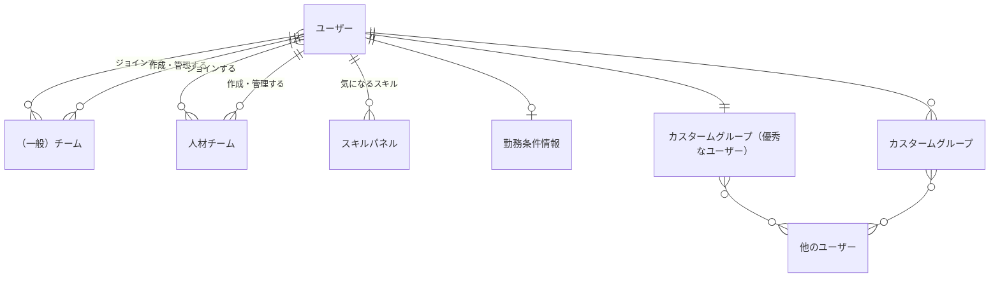

### チームの種類とユーザーとの関係

Brightにおいては主にスキル管理やスキルアップ目的で利用するエンジニアやデザイナー、マーケッターといった利用者も、主に採用、育成目的で利用する人材担当も同一のユーザー体系として管理する。

- ユーザーは個人のユーザーとしてチームに所属せずとも利用できるが、チームに所属することで所属するチームの権限に応じた機能を追加で利用することができる。
- ユーザーは複数のチームに所属することができる
- チームには、チーム作成時に最低一人の管理者が存在し、チームとチームにジョインするユーザーの管理を行う

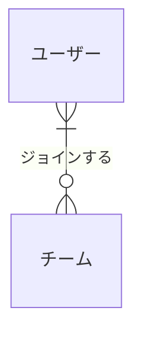

採用、育成などの人材担当向け機能を利用可能かはジョインするチームの種類によって制限される。

- 同一のユーザは人材チームとエンジニアチームに同時に参加することができる
- 人材チームは特定の権限をもつユーザーのみが作成することができる。

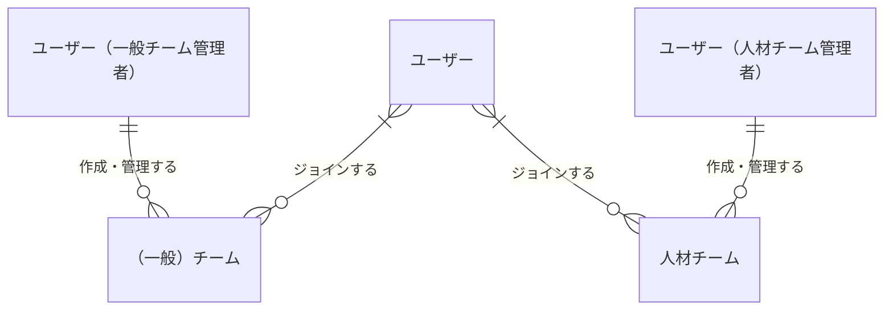

### ユーザーが持つ従属情報

- ユーザーは実際に評価対象にするスキル以外に、「気になるスキル」として複数のスキルパネルを登録することができる

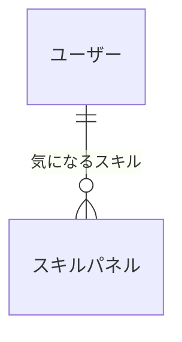

- ユーザーは採用の前提となる勤務条件を事前に登録することができる

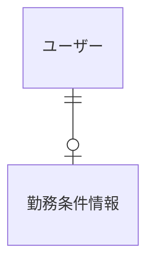

### ユーザー、（一般）チームと人材チームの関係

人材チームは個人のユーザー、またはチームのスキルを検索し、ユーザー（エンジニア）を採用する。

- 人材チームが一般チーム、または個人のユーザーに面談のオファーを送り、承諾された場合、ユーザー詳細情報が人材チームに開示される
- ユーザー、またはチームが採用、委託など仕事上のつながりが確定した場合、対象の（一般）チームが人材チームの人材支援をうけているとみなされる
- チームが管轄対象となった場合、ジョインしているユーザー全員が人材支援対象とみなされる
- 人材支援対象となったチームに新たなユーザーがジョインした場合、自動的に人材支援の対象ユーザーとみなされる
- 人材チームが人材チームを人材支援することはできない

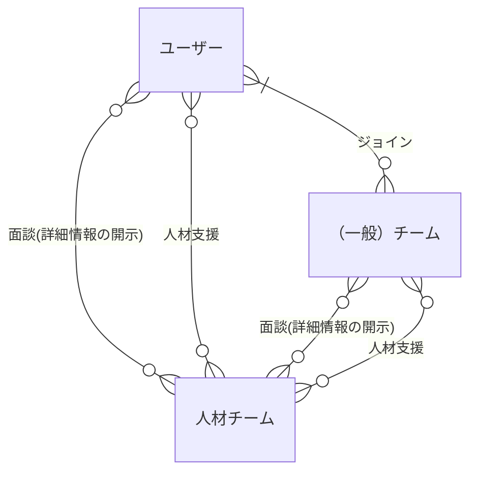

- 離任後人材チームから詳細情報の閲覧権限が失われた場合も離任者として過去の着任履歴はのこり続ける ！！！人材支援と着任離任の表現に違和感！！！

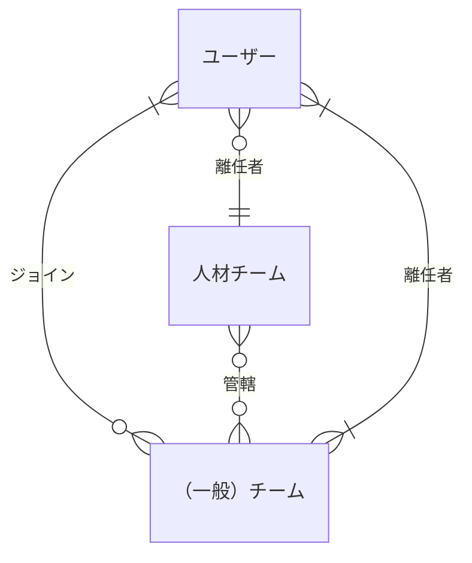

### サブチーム

チームの種類を問わず、既に作成済のチームをサブチームとしてチームメンバーに加えることができる。

- サブチームの定義は１階層のみ可能で、サブチームの下に更にサブチームを定義することはできない（チーム内メンバーとしてサブチームを定義しているチームはチームメンバー追加時の候補に加えてはならない）
- チーム、サブチーム間でジョインしているユーザーが重複するケースも可とする
- サブチームのメンバーはその時点でのリレーションによって参照される為、サブチームが削除された場合やサブチームにメンバーの変更があった場合、自動的に親チームの構成メンバーが変更されたこととなる

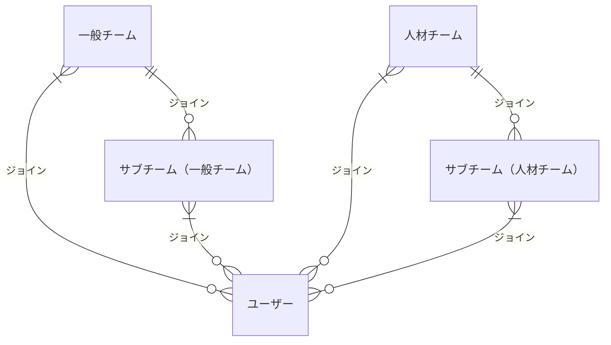

- サブチームはメンバーの参照の為のみに利用され、チーム固有に開放される機能は親チームの持つ権限によって判断される
- !!! チームの種類がことなる場合、人材機能の利用可否などの権限は親チームの権限を参照する（一般チームのサブチームとして人材チームを加えても、人材機能を利用できるようにはならない）

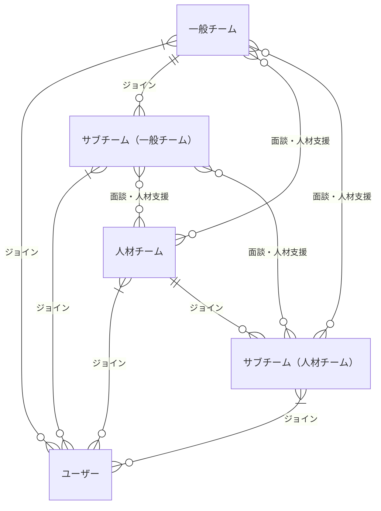

### カスタムグループ

チームとは別にあるユーザーからみて関係をもつ複数のユーザーをグループとして関連付けることができる。
これをカスタムグループと呼ぶ。
カスタムグループはあくまでカスタムグループを作成したユーザー個人のもので、グループに加えられた側のユーザーには影響しない(相互参照関係に自動的になるわけではない)

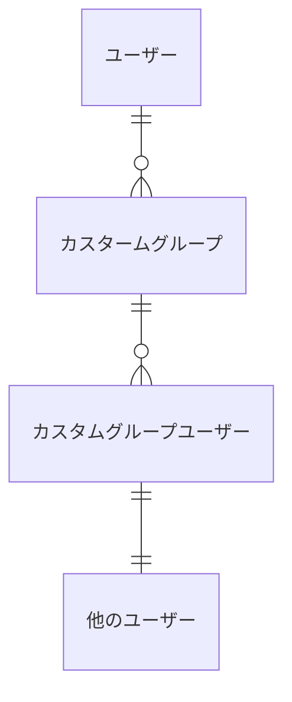

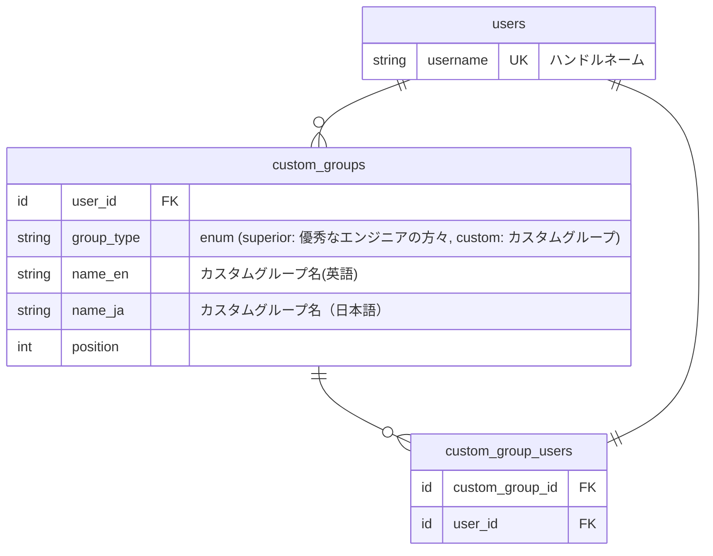
### 特別なカスタムグループ

カスタムグループの名称はユーザーが任意に決定して作成できるが、以下のカスタムグループや固定の名称と特別な画面導線、機能をもつ。

- キャリアの参考になるユーザーは初期状態でカスタムグループが自動作成される

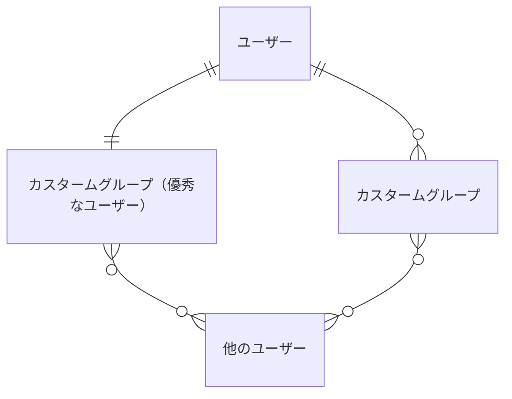

