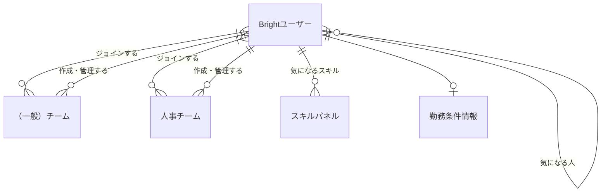
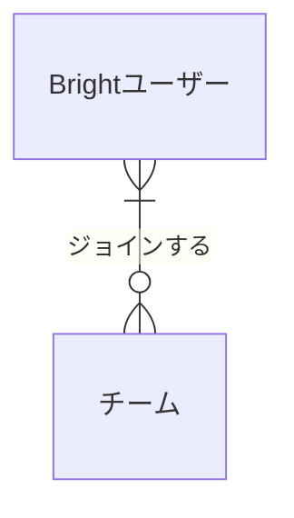
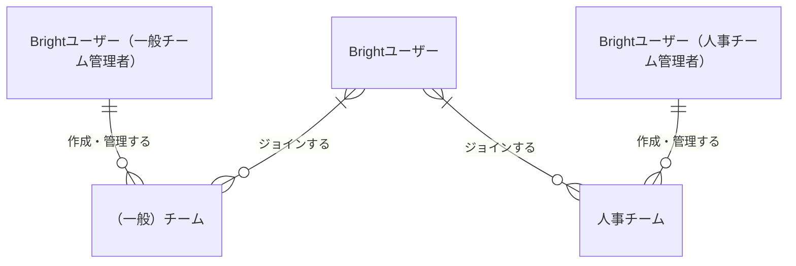
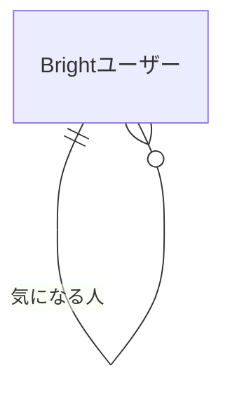
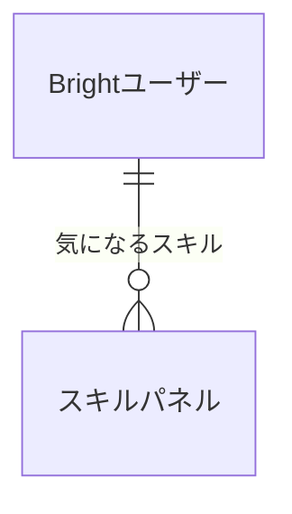
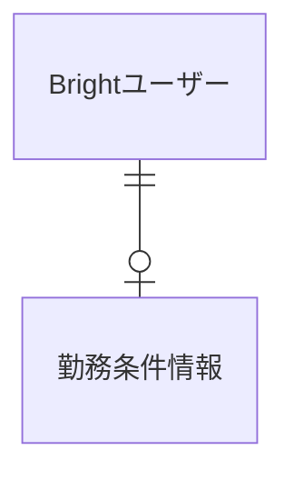
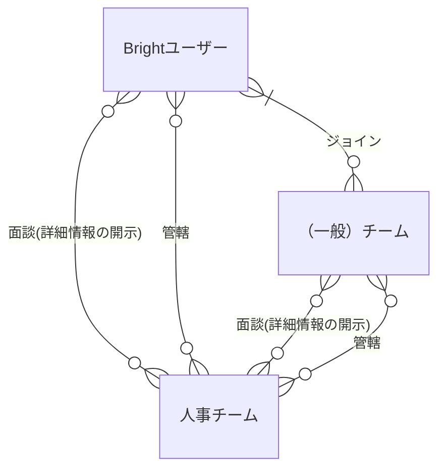
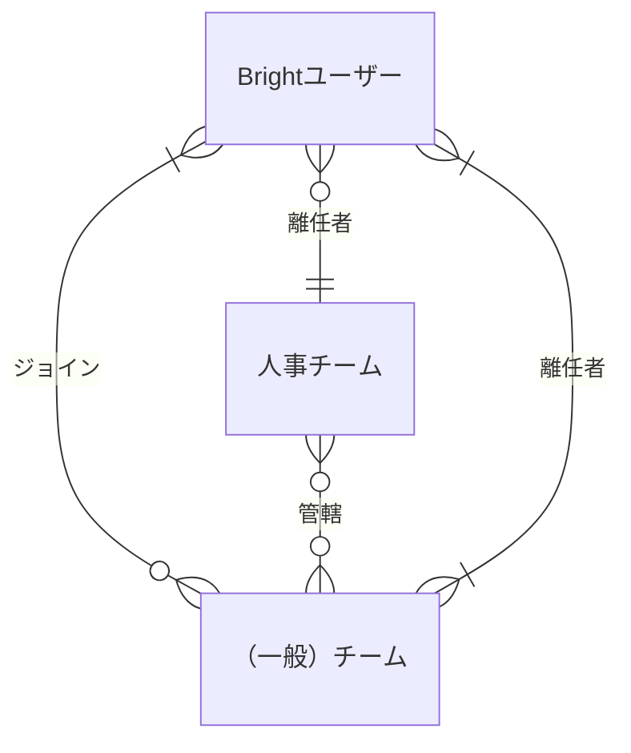
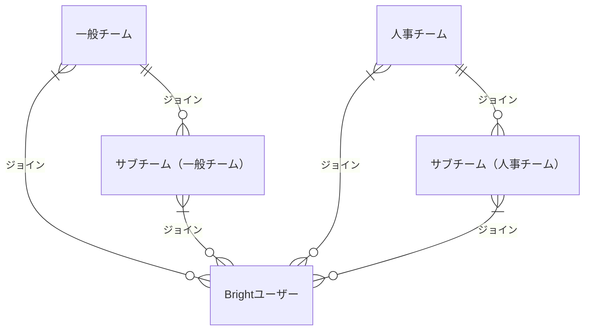
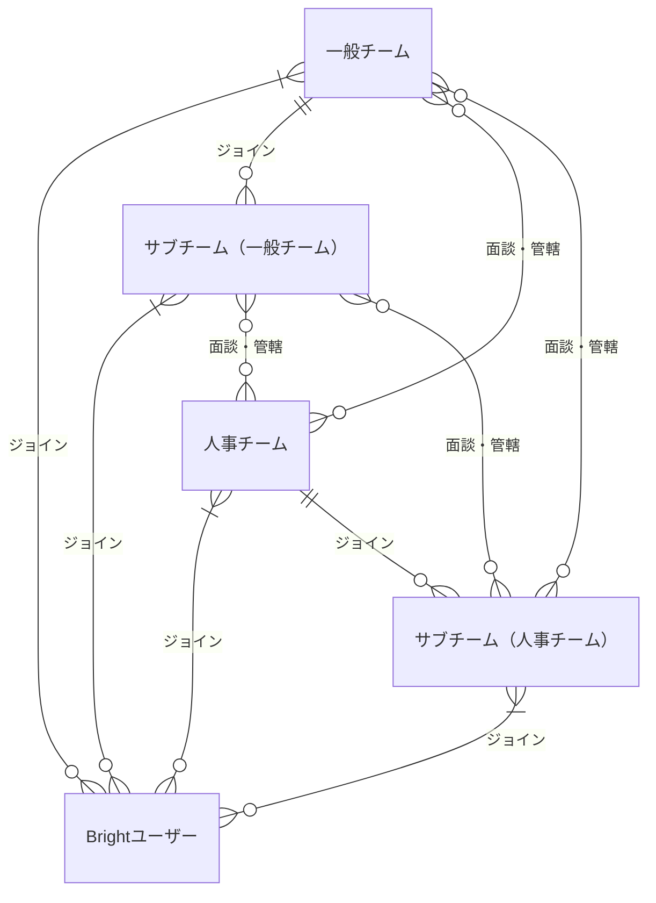

## ユーザーとチーム

Brightを利用するユーザーと複数のユーザーから構成されるチームに関する概念を扱う

### 関係するシート

- 1.Brightユーザー
- 2.チーム
- 3.スキルパネル
- 6.気になるスキル
- 7.気になる人
- 8.チームとユーザー

### 概念ER図（ユーザーとチーム）

#### チームの種類とユーザーとの関係

Brightにおいては主にスキル管理やスキルアップ目的で利用するエンジニアやデザイナー、マーケッターといった利用者も、主に採用、育成目的で利用する人事担当も同一のユーザー体系として管理する。

- ユーザーは個人のユーザーとしてチームに所属せずとも利用できるが、チームに所属することで所属するチームの権限に応じた機能を追加で利用することができる。
- ユーザーは複数のチームに所属することができる
- チームには、チーム作成時に最低一人の管理者が存在し、チームとチームにジョインするユーザーの管理を行う

採用、育成などの人事担当向け機能を利用可能かはジョインするチームの種類によって制限される。

- 同一のユーザは人事チームとエンジニアチームに同時に参加することができる
- 人事チームは特定の権限をもつユーザーのみが作成することができる。

#### Brightユーザーが持つ従属情報

- Brightユーザーは他のユーザーを「気になる人」として登録することができる

- Brightユーザーは実際に評価対象にするスキル以外に、「気になるスキル」として複数のスキルパネルを登録することができる

- Brightユーザーは採用の前提となる勤務条件を事前に登録することができる

# 以下はスプリント1は対象外の概念

### ユーザー、（一般）チームと人事チームの関係

人事チームは個人のユーザー、またはチームのスキルを検索し、ユーザー（エンジニア）を採用する。

- 人事チームが一般チーム、または個人のユーザーに面談のオファーを送り、承諾された場合、ユーザー詳細情報が人事チームに開示される
- ユーザー、またはチームが採用、委託など仕事上のつながりが確定した場合、対象の（一般）チームが人事チームの管轄となったとみなされる
- チームが管轄対象となった場合、ジョインしているユーザー全員が管轄対象とみなされる
- 管轄対象となったチームに新たなユーザーがジョインした場合、自動的に管轄対象とみなされる
- 人事チームが人事チームを管轄することはできない

- 離任後人事チームから詳細情報の閲覧権限が失われた場合も離任者として過去の着任履歴はのこり続ける

#### サブチーム

チームの種類を問わず、チームの下にサブチームを定義することができる。

- サブチームの定義は１階層のみ可能で、サブチームの下に更にサブチームを定義することはできない
- チーム、サブチーム間でジョインしているユーザーが重複するケースも可とする

- サブチームはチームと同様、チーム単位のスキル管理、面談、着任といった機能を利用できる

