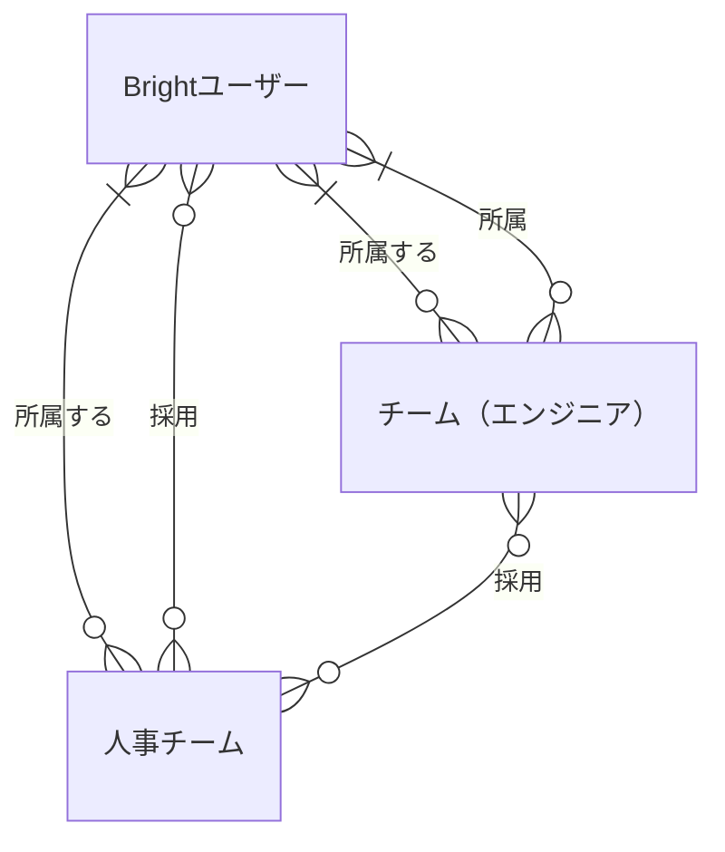
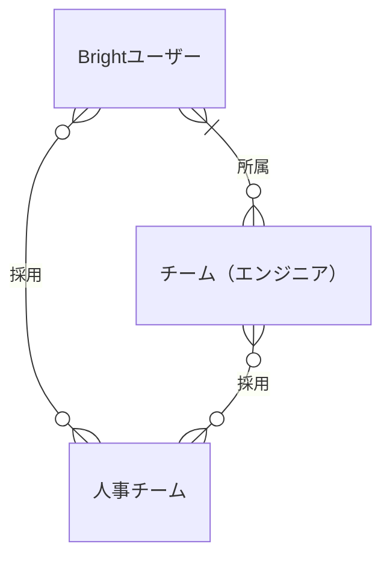
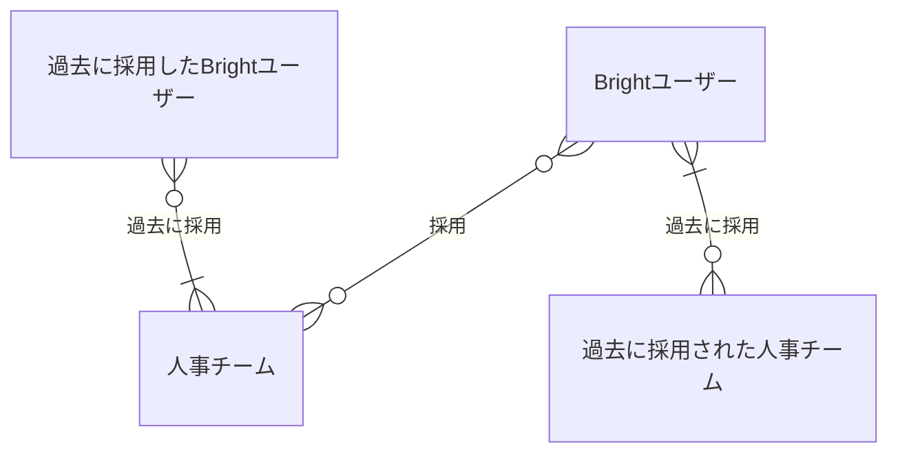

## ユーザーとチーム

Brightを利用するユーザーと複数のユーザーから構成されるチームに関する概念を扱う

### 関係するシート

- 1.Brightユーザー
- 2.チーム
- 3.スキルパネル
- 7.気になる人
- 8.チームとユーザー

### ER図

#### チームの種類とユーザーとの関係

Brightにおいては主にスキル管理やスキルアップ目的で利用するエンジニアやデザイナー、マーケッターといった利用者も、主に採用、育成目的で利用する人事担当も同一のユーザー体系として管理する。

- ユーザーは個人のユーザーとしてチームに所属せずとも利用できるが、チームに所属することで所属するチームの権限に応じた機能を追加で利用することができる。
- ユーザーは複数のチームに所属することができる
- チームには、チーム作成時に最低一人の管理者が存在し、チームと参加するユーザーの管理を行う

採用、育成などの人事担当向け機能を利用可能かは所属するチームの種類によって制限される。

- 同一のユーザは人事チームとエンジニアチームに同時に参加することができる

### ユーザー、チーム（エンジニア）と人事チームの関係

人事チームは個人のユーザー、またはチームのスキルを検索し、ユーザー（エンジニア）を採用する。

- ユーザー、またはチームが採用に至った場合、人事チームへの所属とみなされる
- 人事チームが人事チームに対して採用をすることはできない

- チームが採用に至った場合、その時点で所属するユーザー全員が採用されたとみなされる
- 離任後人事チームから詳細情報の閲覧権限が失われた場合も過去の採用履歴はのこり続ける

### 補足