# インフラ構成

| リソース | 用途 |
| --- | --- |
| Cloud Run | Phoenixアプリケーションを稼働させる |
| Cloud SQL | RDB（PostgreSQL）にデータを保存する |
| Cloud Storage | アップロードされたファイルを保存する |
| SendGrid | メールを送信する |

## 構成管理

[インフラ構成管理](../terraform/README.md)を参照すること。

## Phoenixアプリケーションのデプロイ

Cloud Buildでデプロイ（`cloudbuild.yaml`）する。

GitHub Actionsで自動デプロイ（`.github/workflows/deploy_to_***.yml`）されるため、手動でデプロイする機会は基本的にない。

## バッチ処理の設定・デプロイ

「いつ実行するか」はTerraformで設定する。
「何を実行するか」はCloud Buildでデプロイする。
