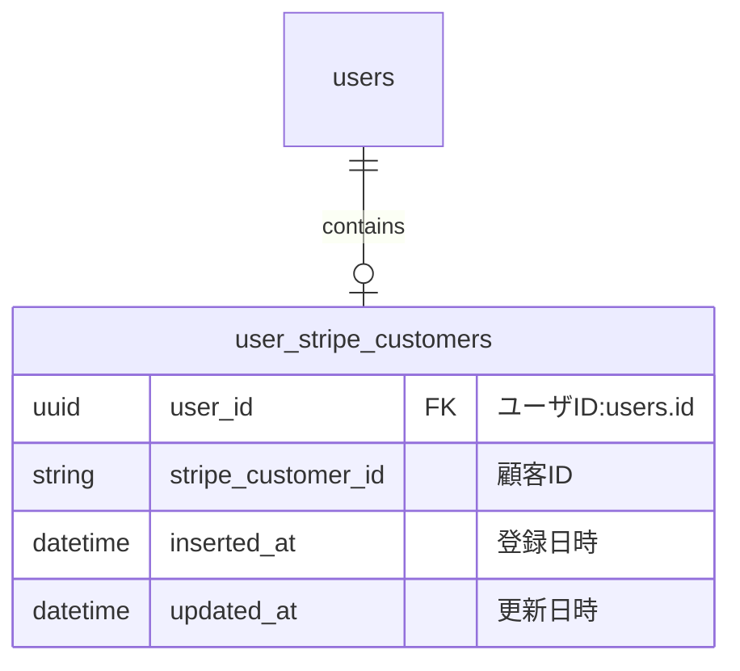
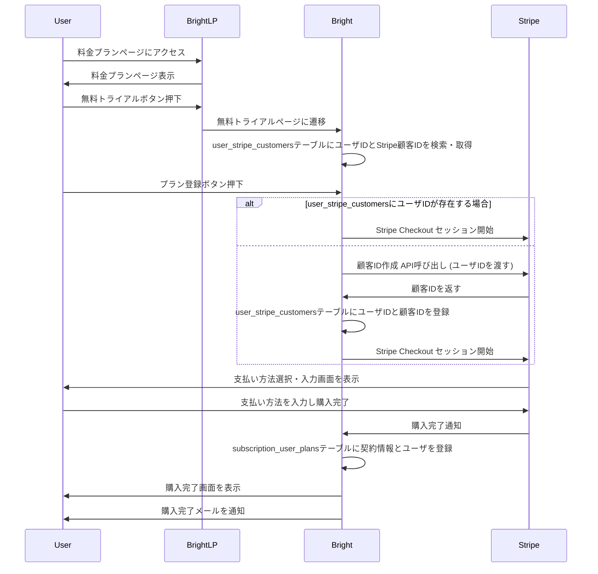

#

```mermaid
erDiagram
user_stripe_customers {
    uuid user_id FK "ユーザID:users.id"
    string stripe_customer_id "顧客ID"
    datetime inserted_at "登録日時"
    datetime updated_at "更新日時"
}

users ||--o| user_stripe_customers: contains

```

## 購入処理

```mermaid
sequenceDiagram
    participant User
    participant BrightLP
    participant Bright
    participant Stripe

    User ->> BrightLP: 料金プランページにアクセス
    BrightLP ->> User: 料金プランページ表示
    User ->> BrightLP: 無料トライアルボタン押下
    BrightLP ->> Bright: 無料トライアルページに遷移
    Bright ->> Bright: user_stripe_customersテーブルにユーザIDとStripe顧客IDを検索・取得
    User ->> Bright: プラン登録ボタン押下
    alt user_stripe_customersにユーザIDが存在する場合
        Bright ->> Stripe: Stripe Checkout セッション開始
    else
        Bright ->> Stripe: 顧客ID作成 API呼び出し (ユーザIDを渡す)
        Stripe ->> Bright: 顧客IDを返す
        Bright ->> Bright: user_stripe_customersテーブルにユーザIDと顧客IDを登録
        Bright ->> Stripe: Stripe Checkout セッション開始
    end
    Stripe ->> User: 支払い方法選択・入力画面を表示
    User ->> Stripe: 支払い方法を入力し購入完了
    Stripe ->> Bright: 購入完了通知
    Bright ->> Bright: subscription_user_plansテーブルに契約情報とユーザを登録
    Bright ->> User: 購入完了画面を表示
    Bright ->> User: 購入完了メールを通知
```

## 解約処理

## プラン変更処理

## 支払い履歴

## 継続課金処理
