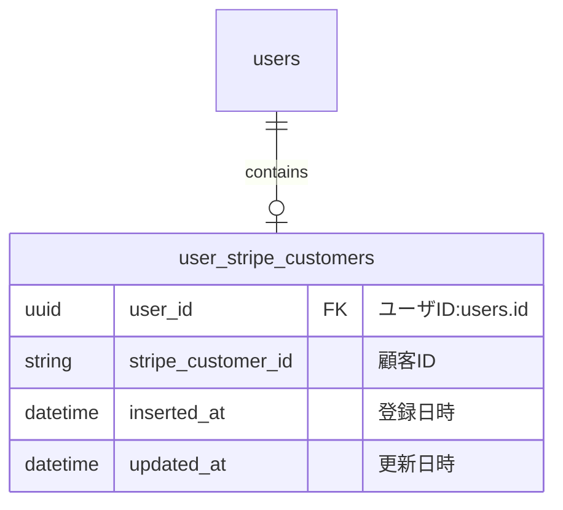
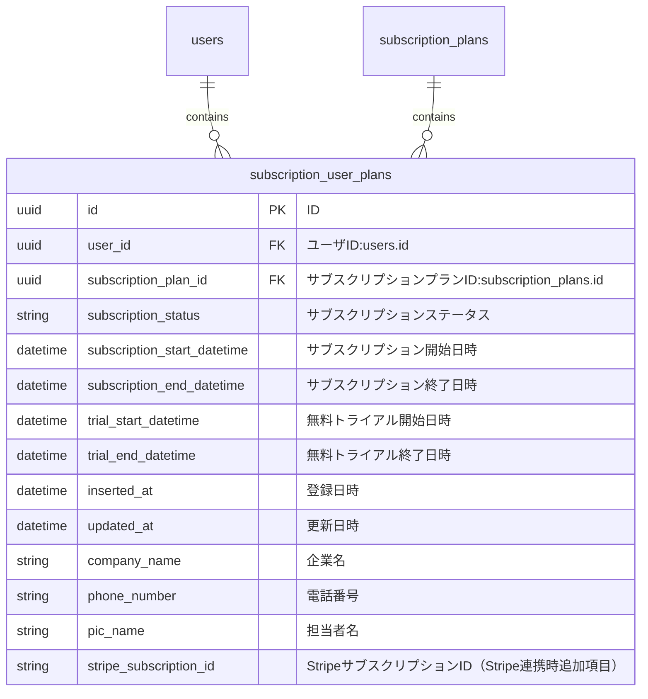
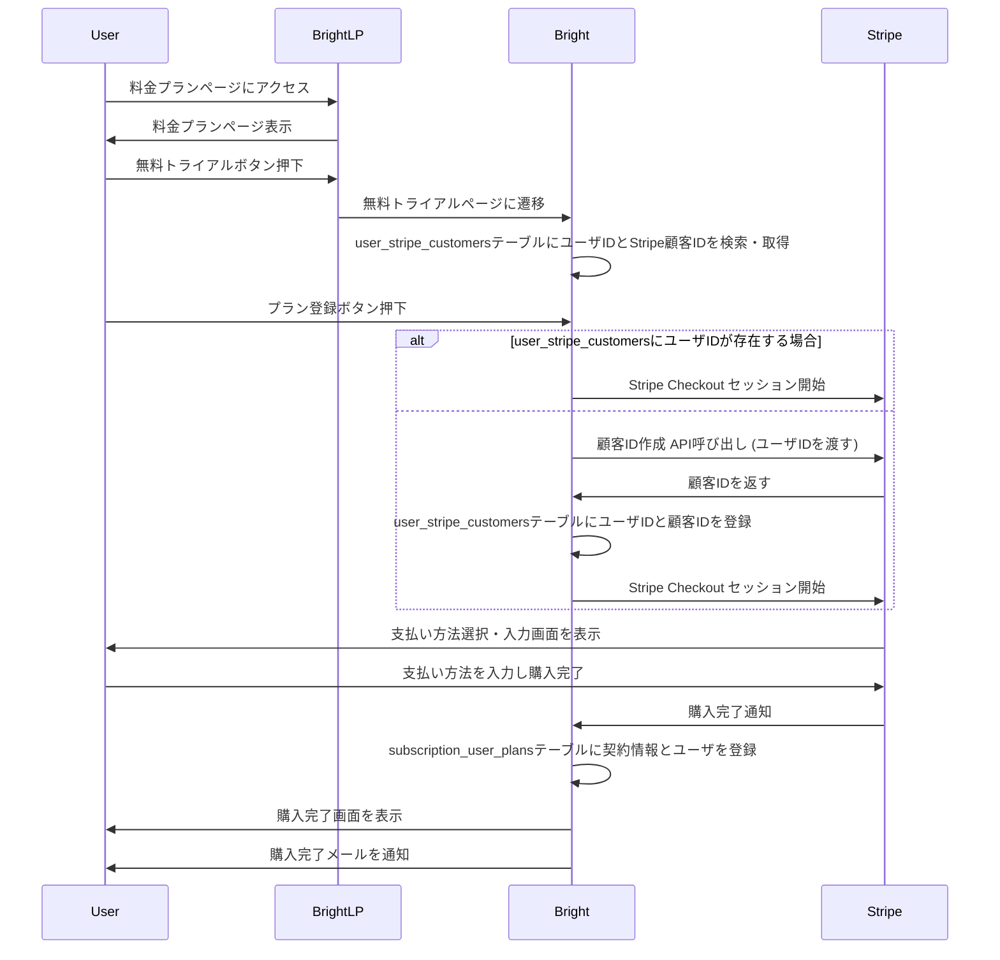
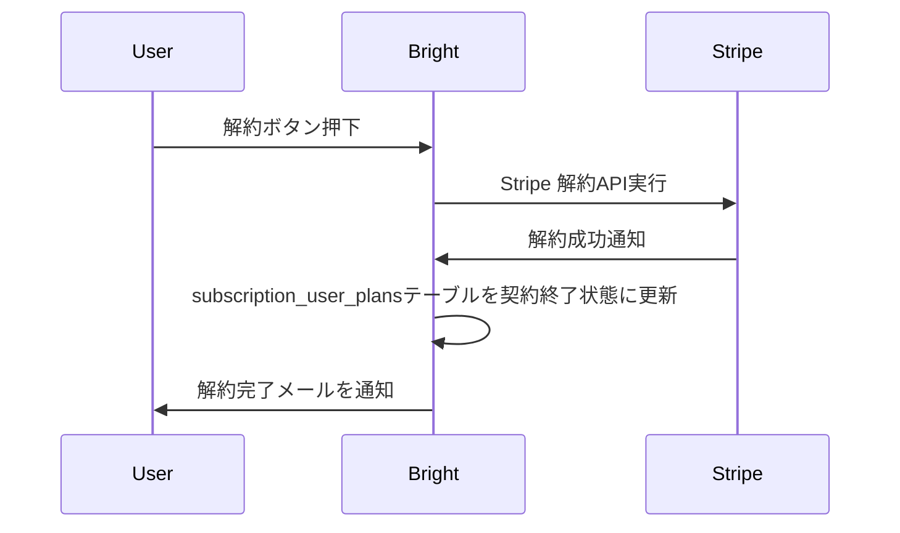
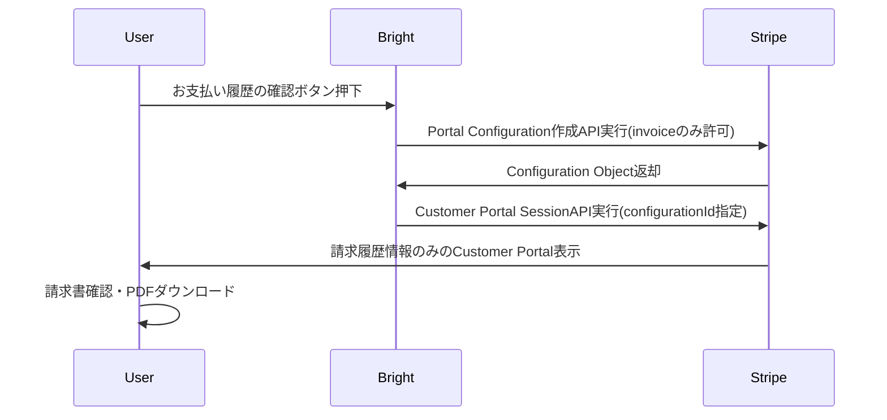
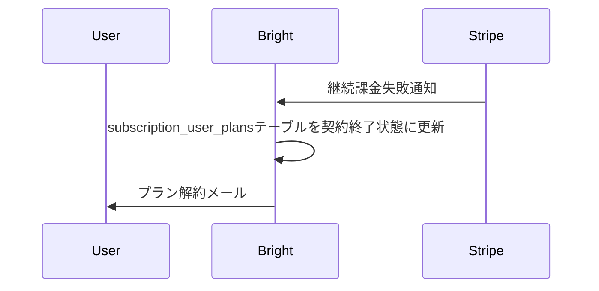

# 決済

## テーブル設計

### user_stripe_customers テーブル

- Stripe の顧客 ID 情報を保存する

### subscription_user_plans テーブル

### 決済履歴を保存するテーブル

Bright 側に不要とのことで作成しない

## 購入処理

## 解約処理

## プラン変更処理

TODO

## 支払い履歴

- [Portal Configuration 作成 API](https://docs.stripe.com/api/customer_portal/configurations/create)

- [Customer Portal SessionAPI](https://docs.stripe.com/api/customer_portal/sessions)

## 継続課金処理

