# 決済

## テーブル設計

### user_stripe_customers テーブル

- Stripe の顧客 ID 情報を保存するテーブルを新設する。

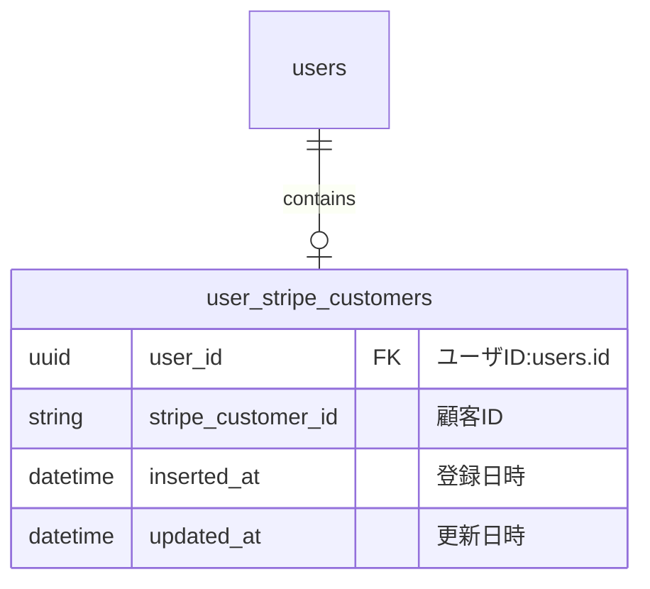

### subscription_user_plans テーブル

- Bright の契約テーブルに Stripe のサブスクリプション ID を保存する項目を追加する。Stripe サブスクリプション ID は解約時に必要となる。

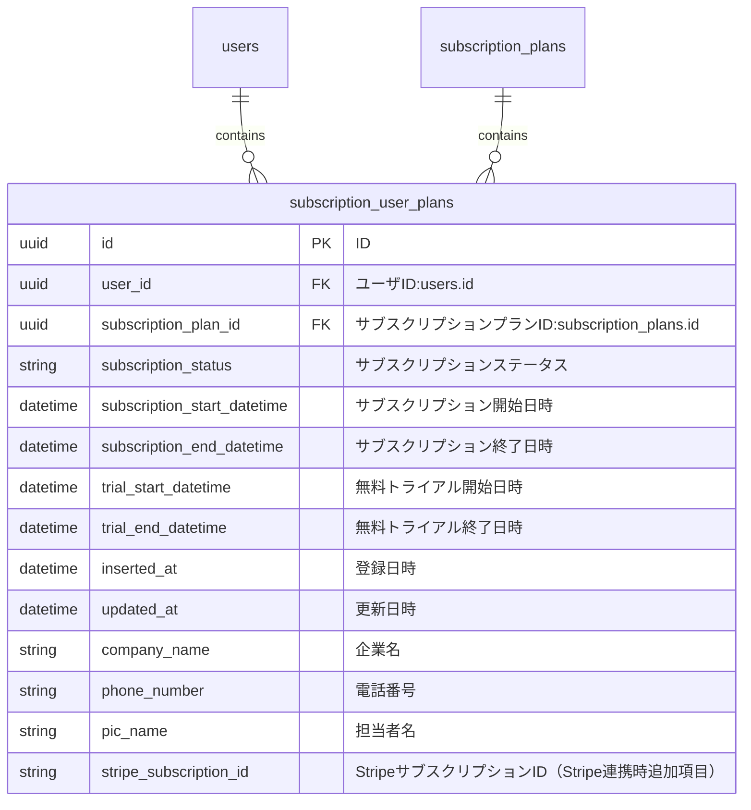

### subscription_plans テーブルと stripe_prices テーブル

- Bright のプランを保存する subscription_plans テーブルに Stripe の商品 ID を保存する項目を追加する。
- Stripe の価格情報を保存するために stripe_prices テーブルを新設する。Stripe Checkout セッション開始時に利用する。

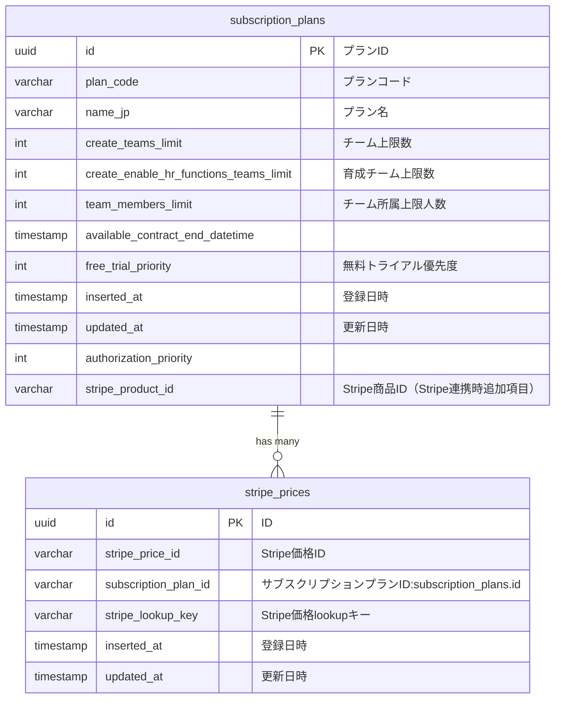

### stripe_customer_portal_configurations テーブル

- Stripe のカスタマーポータルを開く際に機能を限定するために利用する ConfigurationID を保存するためのテーブルを新設する。

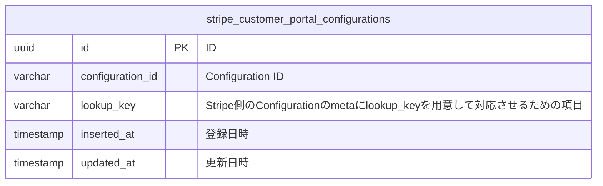

### 決済履歴を保存するテーブル

Bright 側に不要とのことで作成しない

## 購入処理

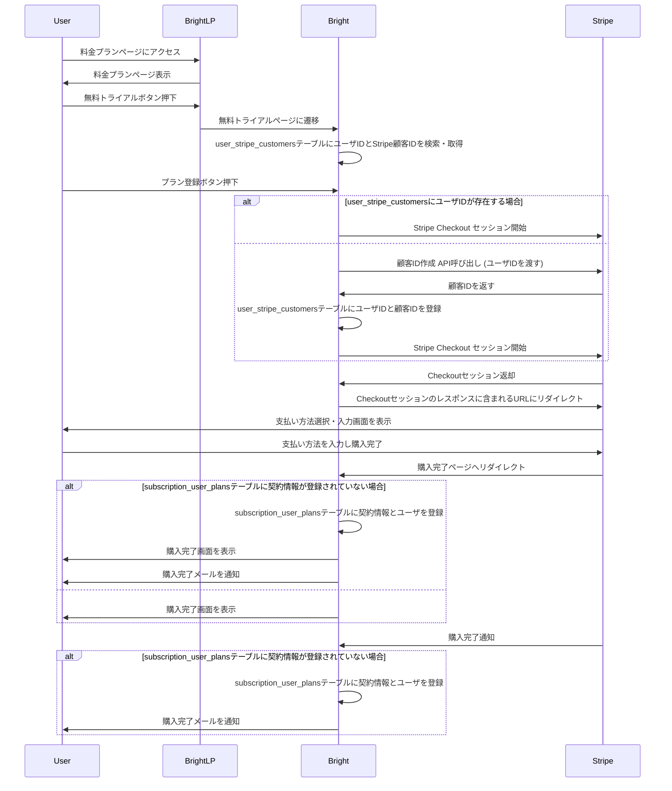

## 解約処理

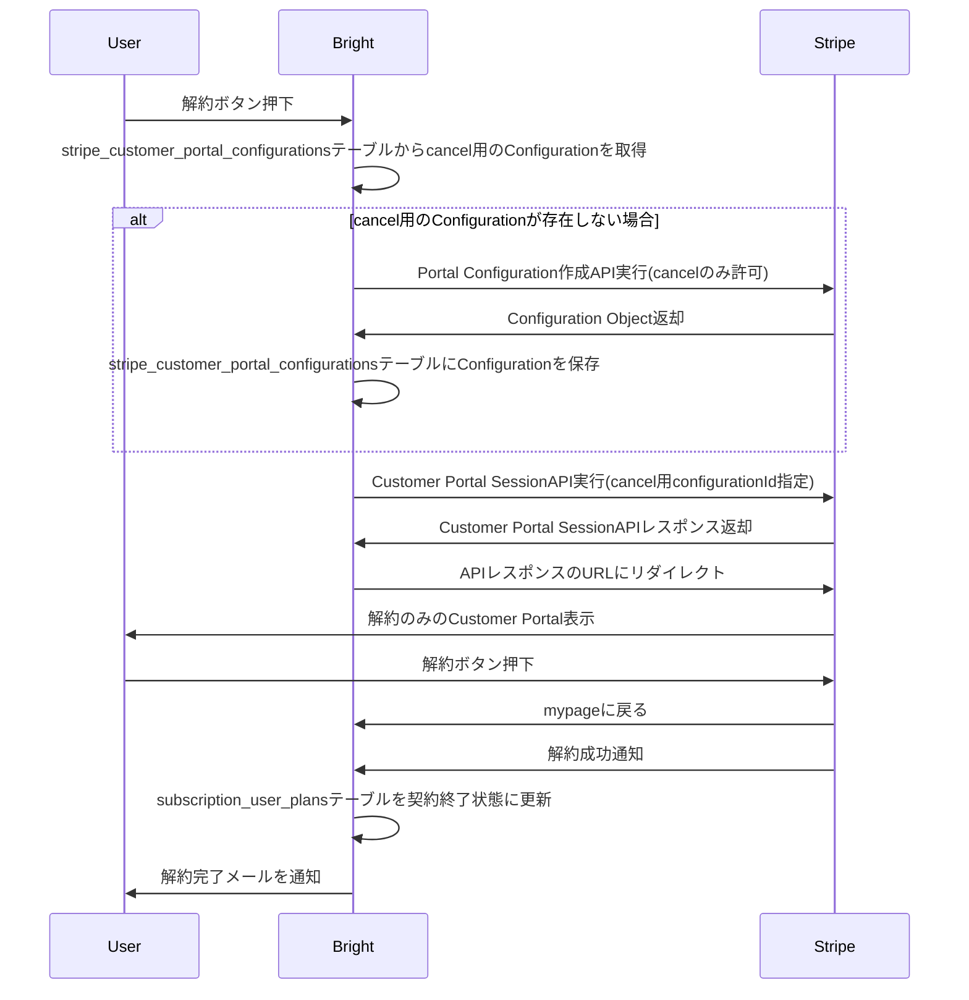

## 支払い方法変更処理(クレカ変更)

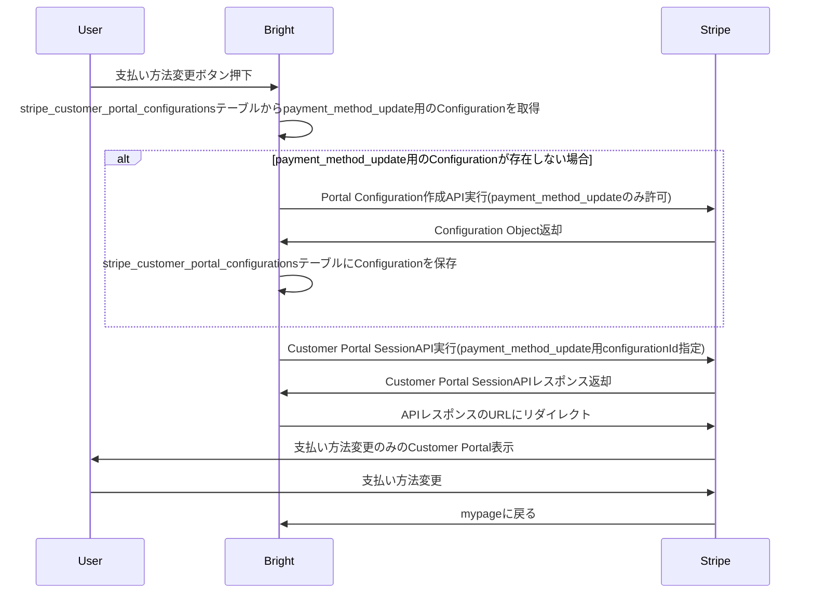

## プラン変更処理

### 無料トライアルプランから無料トライアルプランへの変更

既存の無料トライアル申込の流れと同様のため割愛する
※とはいえ、後で既存の流れを確認した上で追記しておきたい

### 無料トライアルプランから課金プランへの変更

購入処理の流れと同様
※とはいえ、後で既存の流れを確認した上で追記しておきたい

無料トライアルの終了日時を入れるべきか？
ただし、現状無料トライアル申込中に上位プランの無料トライアルを申し込んでも下位プランの終了日時は入らない

### 課金プランから無料トライアルプランへの変更

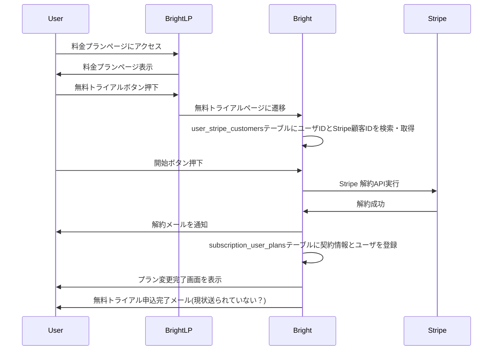

### 課金プランから課金プランへの変更

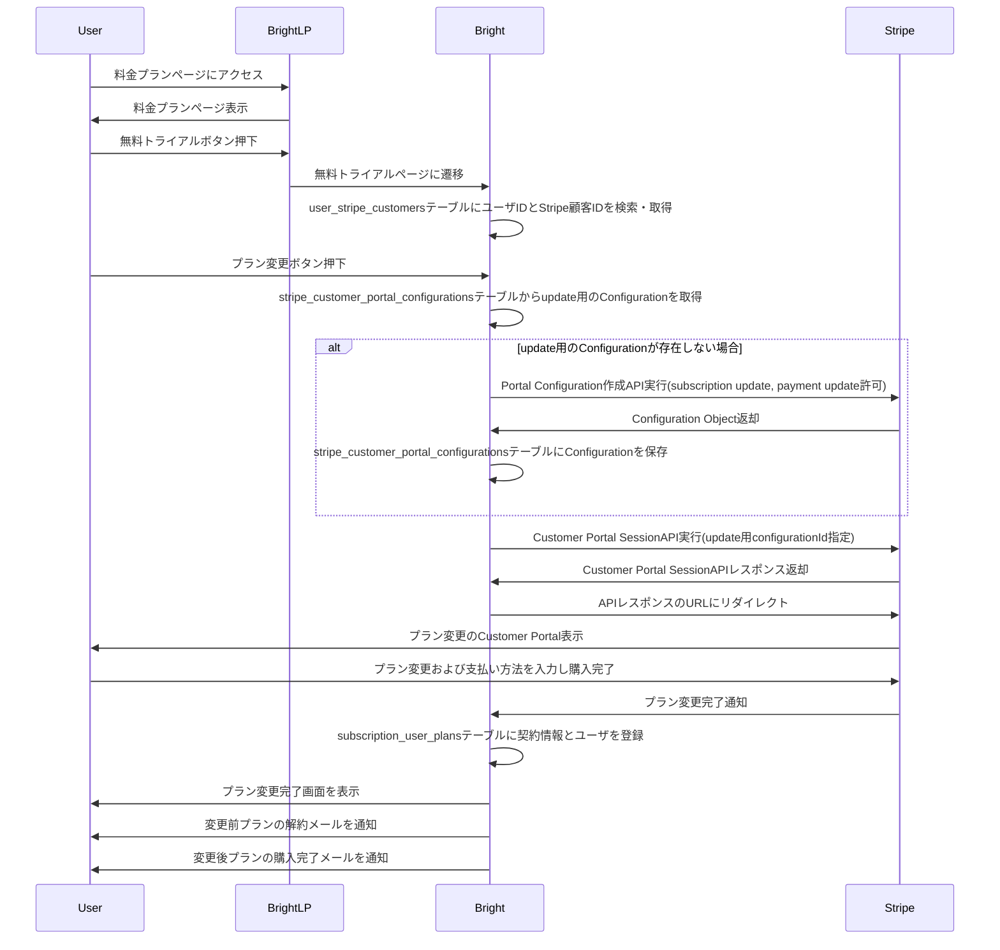

## 支払い履歴

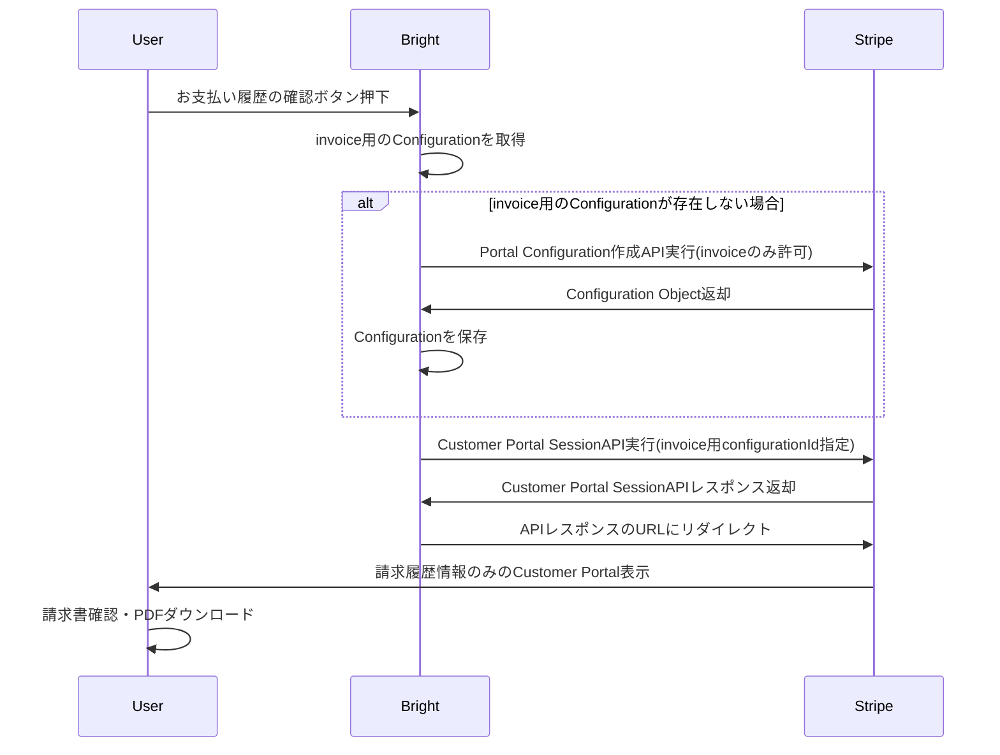

- [Portal Configuration 作成 API](https://docs.stripe.com/api/customer_portal/configurations/create)

- [Customer Portal SessionAPI](https://docs.stripe.com/api/customer_portal/sessions)

## 継続課金処理

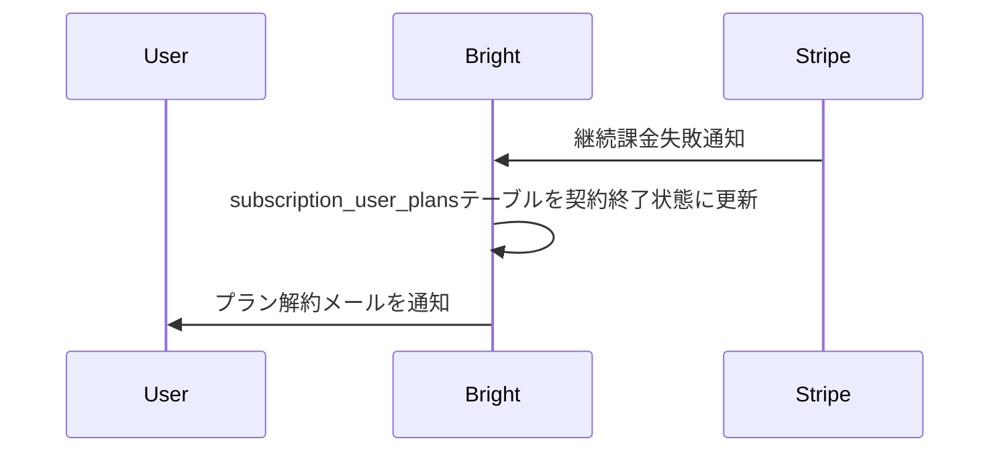
