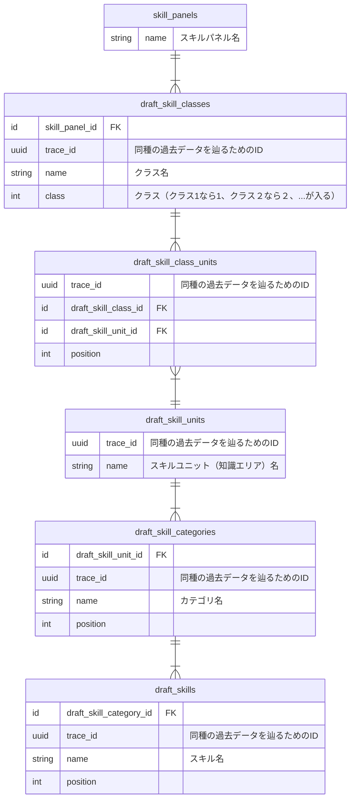
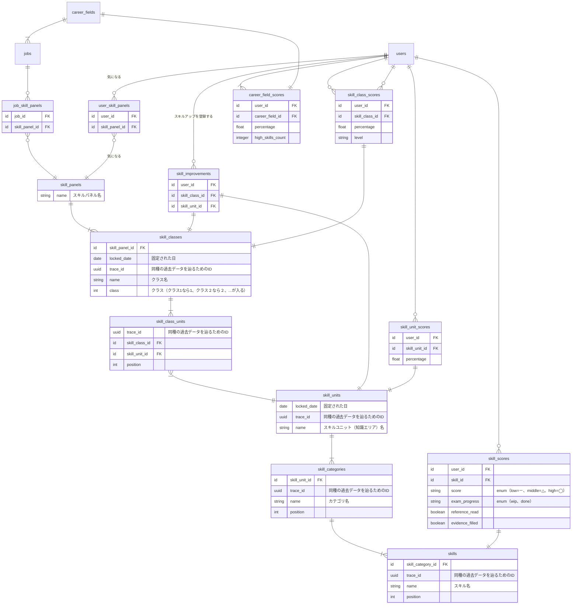
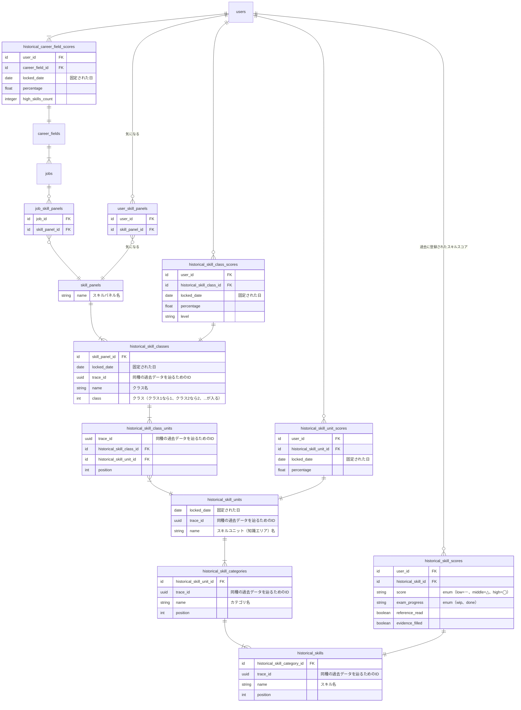

# スキルパネル更新ロジック

# 仕様

[仕様概要](https://docs.google.com/spreadsheets/d/1LMjOVjd5VOrb-sKiUFUB9cSHy3QQN6evp1Gj1cpeEUs/edit#gid=173617957) より、スキルパネルの更新に関わる部分を抜粋。

> Ｕ－ｅ）成長グラフ：スキルパネル毎に、スキル成長（時系列）とスキルジェムを、過去履歴（3ヶ月毎、マスタも込み）／未来（≒スキルアップ対象）で切り替えて参照できる ※3ヶ月自動〆
>　→スキルセットに対しても上記同様の参照ができる
>　→システムの性能面が許せば、成長グラフだけで無く、スキルパネルの過去履歴（3ヶ月毎、マスタも込み）も参照可能とする
>　→学習／試験結果／エビデンス登録状況の統計値を表示する

>Ｕ－ｆ）スキルパネル毎に、保有スキルの記入／更新ができ、スキルスコアが算出される ※上位クラスは下位クラスの平均（≒40%）をクリアすると開放される
>　→各スキルパネルへのスキルアップが設定できる
>　→設定されたスキルアップに応じた教材学習や試験の実施が定期的に推奨される
>　→スキルアップが2週間行われない場合やスキルアップ対象が6個以上設定された場合は、スキル入力を求めるか、別スキルアップへの入れ替え、スルーを打診する
>　→全スキル知識エリアのマスタと全ユーザの保有スキルは3ヶ月に1度、スキル知識エリアの洗い替えと同時に過去履歴としてコピーされる（バッチ処理、要更新タイミング向け設計）


# スキルパネル周りのテーブル設計

スキルパネル周りのマスタデータは、「運営下書き」「公開」「履歴」の3種類のテーブルを作成する。

| 種別 | 概要 |
| --- | --- |
| 運営下書き | 管理画面でのCRUD対象のテーブル。ユーザーから閲覧されることはない。 |
| 公開 | 現在公開されているテーブル。ユーザーが閲覧したりスキルスコア等を登録したりする。 |
| 履歴 | 過去の履歴を表すテーブル。成長グラフと過去のスキルパネルを表示するために参照する。 |

テーブルを分ける目的は以下のとおり。

- 各データの役割を明確にする（3種類のデータが1つのテーブルに入っているという状況を避ける）
- 時間が経つにつれて公開データに対する処理のパフォーマンスが落ちていくことを回避する
  - 参考：[スキルパネルレコード数予測](https://docs.google.com/spreadsheets/d/1U1GAmMHUVS7wm2ejQ9wXmVoRMr79BrMRR4gzmoe0upg/edit#gid=396976561)

## 運営下書き



## 公開



## 履歴



## テーブルやデータについての補足

- スキルパネル `skill_panels` は、名前しか持たずクラスをまとめているだけのものであるのと、ジャンル・気になる・オンボーディング等のスキルスコアとは関係のないデータと紐づくことから、わざわざコピーする必要はないと判断しコピーは行わない
- 固定された日 `locked_date` について
    - 3ヶ月ごとに更新するため、「2023-07-01」や「2023-04-01」といった値が入る
- 同種の過去データを辿るためのID `trace_id` について
    - 同じIDのものは同じデータの履歴を表す
    - 以下は実際に入るであろうスキルユニットのデータの例
        - `draft_skill_units` （運営下書き）
            | trace_id | name | inserted_at | updated_at |
            | --- | --- | --- | --- |
            | 88E35D86-8A8B-4B0C-B906-0B840A0ACD2D | Elixir基礎 | 2023-07-01 00:00:00 | 2023-07-20 12:34:56 |
            | 16EE65AE-05A0-495B-BDEE-88D70FC7002A | テスト | 2023-07-01 00:00:00 | 2023-07-24 09:01:23 |
        - `skill_units` （公開）
            | trace_id | locked_date | name | inserted_at | updated_at |
            | --- | --- | --- | --- | --- |
            | 88E35D86-8A8B-4B0C-B906-0B840A0ACD2D | 2023-07-01 | Elixir本体 | 2023-04-01 00:00:00 | 2023-07-01 00:00:00 |
            | 16EE65AE-05A0-495B-BDEE-88D70FC7002A | 2023-07-01 | テスト | 2023-04-01 00:00:00 | 2023-07-01 00:00:00 |
        - `historical_skill_units` （履歴）
            | trace_id | locked_date | name | inserted_at | updated_at |
            | --- | --- | --- | --- | --- |
            | 88E35D86-8A8B-4B0C-B906-0B840A0ACD2D | 2023-01-01 | Elixir本体 | 2022-11-05 19:58:00 | 2023-01-01 00:00:00 |
            | 88E35D86-8A8B-4B0C-B906-0B840A0ACD2D | 2023-04-01 | Elixir本体 | 2023-01-01 00:00:00 | 2023-04-01 00:00:00 |
            | 16EE65AE-05A0-495B-BDEE-88D70FC7002A | 2023-04-01 | テスト | 2023-02-18 11:30:00 | 2023-04-01 00:00:00 |
    - `trace_id` のみ、子テーブルにも持つ
        - 親の付け替えを想定すると、子テーブルのデータも履歴を辿れるほうが良い
        - 値は親テーブルと同じである必要はないため、異なる値にする

- 更新タイミング時のスキルユニットのクラス移動について
  - スコアは変わらない
  - クラス内のパーセントを再計算する
  - クラス内のレベルが再判定される
  - 再判定については、クラス開放はあるけど、クラス開放閉じは無し

# 更新ロジックのざっくりした流れ

- 運営下書き→公開
    1. 運営下書きテーブルに入っているデータを公開テーブルにコピーする
        - `draft_skill_classes` → `skill_classes`
        - `draft_skill_class_units` → `skill_class_units`
        - `draft_skill_units` → `skill_units`
        - `draft_skill_categories` → `skill_categories`
        - `draft_skills` → `skills`
        - 公開テーブルの `locked_date` には処理を実行した日付を入れる
    2. `skill_class_scores`, `skill_scores`, `skill_unit_scores`, `career_field_scores` のデータを同テーブルにコピーし、1のコピー先データに紐付ける
        - 1のコピー先データがなければコピーしない
    3. 関連する外部キーを1のコピー先データに付け替える
        - `skill_evidences` の外部キー(skill_id)
        - `skill_exams` の外部キー(skill_id)
        - `skill_references` の外部キー(skill_id)
        - 1のコピー先データがなければ削除する
- 公開→履歴
    1. 公開テーブルに入っているデータを履歴テーブルにコピーする
        - `skill_classes` → `historical_skill_classes`
        - `skill_class_units` → `historical_skill_class_units`
        - `skill_units` → `historical_skill_units`
        - `skill_categories` → `historical_skill_categories`
        - `skills` → `historical_skills`
        - `skill_class_scores` → `historical_skill_class_scores`
        - `skill_scores` → `historical_skill_scores`
        - `skill_unit_scores` → `historical_skill_unit_scores`
        - `career_field_scores` → `historical_career_field_scores`
        - `historical_skill_class_scores`, `historical_skill_unit_scores`, `historical_career_field_scores`の `locked_date` には処理を実行した日付を入れる
    2. 1のコピー元データを公開テーブルから削除する
- 履歴はどこにもコピーしない

## バッチ処理の手動実行メモ

```elixir
Bright.Batches.UpdateSkillPanels.call(~D[2023-07-01])
```

- 公開データのlocked_dateと同じ値を指定した場合
  - ユニーク制約エラー
- 履歴データのlocked_dateと同じ値を指定した場合
  - エラーは出ない
  - locked_dateが同じ履歴が複数件できる
