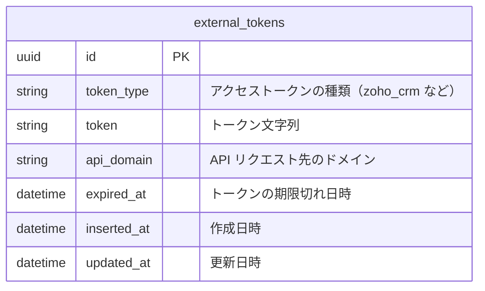

# ZOHO（MA）連携

Bright は MA （マーケティングオートメーション）ツールの一種である ZOHO と連携をする。

ZOHO には様々なサービスがあるが、今回は ZOHO CRM との連携を行う。

- Bright ユーザーの新規登録時
- Bright ユーザーの情報が変化した時
  - ハンドル名
  - email（プライマリーのみ）
- コミュニティ機能
  - （管理画面などで）コミュニティの作成時
  - コミュニティの所属・脱退時
- ユーザーのステージ変化時

なお上記は本番環境でのみ行う。`Bright.Utils.Env` での制御を行う。

## API 連携の概要

ZOHO CRM とは API 経由で連携を行う。

認証・認可は OAuth2 を用いる。

様々な形式があるが、今回は Self Client の Client credentials flow を用いる。

※ Self Client を作成したアカウントに紐づいて API の実行が行われるので、作成するアカウントには注意が必要

https://www.zoho.com/accounts/protocol/oauth/self-client/client-credentials-flow.html

以下 URL で作成可能。

https://api-console.zoho.jp/

### アクセストークンの取得形式

Client ID と Client Secret のペアを用いてアクセストークンの取得を行う。

また soid と呼ばれる識別子がリクエスト時に必要である。

これら Client ID / Client Secret / soid の 3 つは秘匿情報として Secret Manager に設定し、環境変数経由で取得する。厳密には soid は秘匿しなくてもいいかもしれないが、明確な記述が見当たらなかったので念のため併せて秘匿する。

### アクセストークンの取得・管理方法

`POST https://accounts.zoho.jp/oauth/v2/token` に対してリクエストをすると、以下のように 3600 秒有効なアクセストークンが返却される。なおリフレッシュトークンは返却されず、必要であれば再度リクエストが必要。

```json
{
  "access_token": "1000.xxx.xxx",
  "api_domain": "https://www.zohoapis.jp",
  "token_type": "Bearer",
  "expires_in": 3600
}
```

以下のドキュメントによると 10 分間で最大合計 10 回のアクセストークンリクエスト制限があるため、都度発行するとエラーになる可能性がある。そのため、適切に管理が必要。

https://www.zoho.com/accounts/protocol/oauth/token-limits.html

以下のようなテーブルを作成する。



アクセストークンが必要な際は、まずこのテーブルを用いて、すでに取得済みのトークンが存在するかを確認する。

期限が切れている場合はトークンを発行してレコードを更新する。

なおリクエスト中に期限が切れることを防ぐため、残り 5 分未満であれば期限切れとみなす。

### アクセストークンを用いた API のリクエスト

URL が API トークン取得時（https://accounts.zoho.jp）とは異なり、アクセストークンリクエスト時に返却される api_domain で行う必要があることに注意。

ドキュメントは以下。

https://www.zoho.com/crm/developer/docs/api/v6/get-records.html

### 実装箇所

ZOHO CRM とのやりとりは `Bright.Zoho.Crm` に定義。

HTTP Client は [Tesla](https://github.com/elixir-tesla/tesla/) を使用。

## Bright ユーザーの新規登録のフロー

- POST {api_domain}/crm/v6/Contacts

```json
{
  "data": [
    {
      "Last_Name": "ハンドル名",
      "Email": "xxx@example.com",
      "field9": "Brightユーザー"
    }
  ]
}
```

※ "field9" は「連携元」カスタム項目（※エンタープライズ機能のみ）のフィールド名。`/crm/orgxxxxxx/settings/api/modules/Contacts?step=FieldsList` で確認可（xxxxxx は ZOHO の soid）。

※ API 実行がエラーになった場合でも、ユーザー登録処理全体はエラーにせず error レベルのログを出すに留める。（ZOHO がエラーになった時にユーザー登録ができないのは困るため）

## Bright ユーザーの情報変化時のフロー

- GET {api_domain}/crm/v6/Contacts/search?email={user_email}

`email` で検索して、 `record_id` を取得する

※ ZOHO 側にユーザーが見つからなくても、登録処理全体はエラーにせず warn レベルのログを出すに留める。

- PUT {api_domain}/crm/v6/Contacts/{record_id}

```json
{
  "data": [
    {
      "Last_Name": "ハンドル名",
      "Email": "xxx@example.com"
    }
  ]
}
```

で更新する。更新に失敗したら例外を発生させる。

## コミュニティ機能

※ ZOHO のカスタムタブの機能を使用する。（エンタープライズ機能のみ）

1 ユーザーが複数のコミュニティに参加できるようにするため N:N で紐づけができる必要がある。

### ZOHO 側の事前準備

- コミュニティのカスタムタブを作成
- 連絡先（ZOHO 側のユーザを管理するタブ）の項目に、作成したコミュニティのカスタムタブを設定

### コミュニティの作成

WIP

### コミュニティの所属・脱退

WIP

## ユーザーのステージ変化

WIP

## ローカル環境での動作確認方法

無料トライアルができるので、そこで動作確認可能。

https://www.zoho.com/jp/crm/welcome.html

一部機能はエンタープライズ機能である必要があり、これは 15 日間のみ有効なので、確認が必要な場合はこの間に行う。
