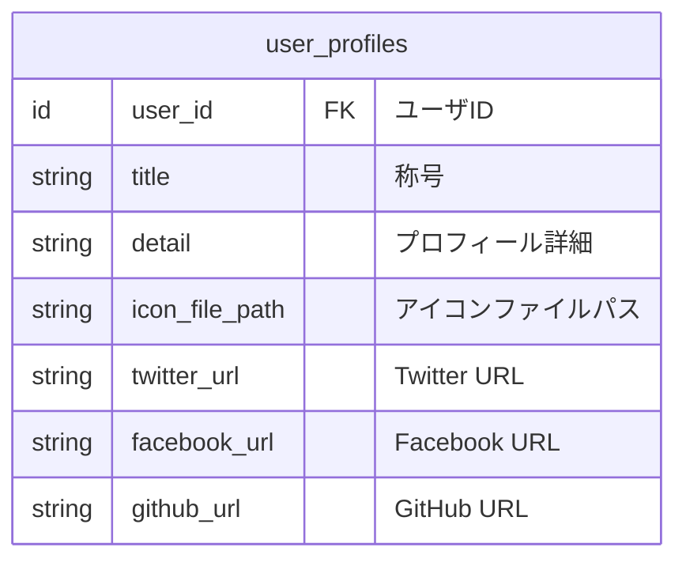

# テーブル設計
- マイページに関連するテーブル設計
- 共通仕様カラムは省略

***
## ユーザプロフィールテーブル

```mermaid
erDiagram
  user_profiles {
    id	user_id	FK "ユーザID"
    string title "称号"
    string detail "プロフィール詳細"
    string icon_file_path "アイコンファイルパス"
    string twitter_url "Twitter URL"
    string facebook_url "Facebook URL"
    string github_url "GitHub URL"
  }
```
