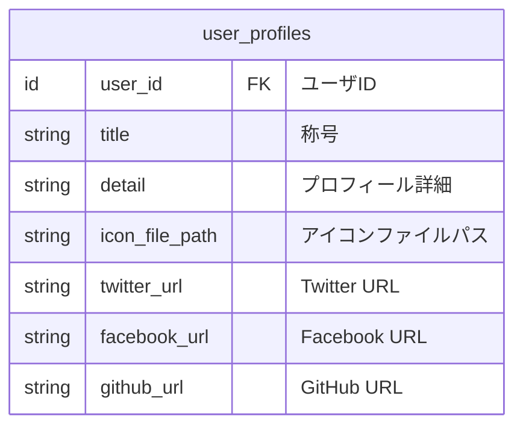
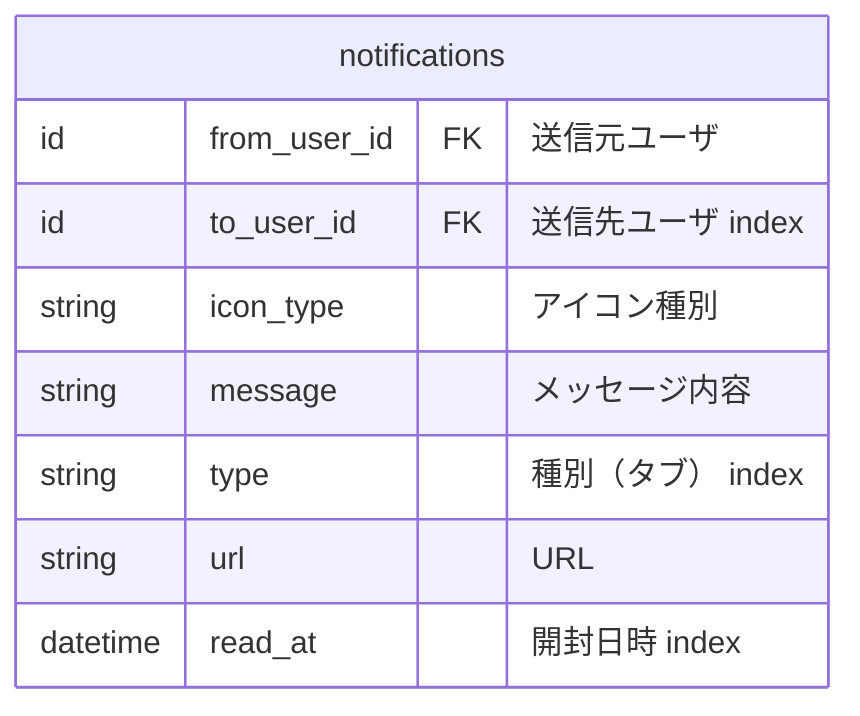

# テーブル設計
- マイページに関連するテーブル設計
- 共通仕様カラムは省略

***
## ユーザプロフィールテーブル

```mermaid
erDiagram
  user_profiles {
    id	user_id	FK "ユーザID"
    string title "称号"
    string detail "プロフィール詳細"
    string icon_file_path "アイコンファイルパス"
    string twitter_url "Twitter URL"
    string facebook_url "Facebook URL"
    string github_url "GitHub URL"
  }
```
***

## 通知テーブル
前提事項
- 通知はどの種類でも共通とする
  - 通知の種類ごとフォーマットが違うと一箇所に表示の時に変換が大変になるため

```mermaid
erDiagram
  notifications {
    id from_user_id	FK "送信元ユーザ"
    id to_user_id	FK "送信先ユーザ index"
    string icon_type	"アイコン種別"
    string message	"メッセージ内容"
    string type	"種別（タブ） index"
    string url "URL"
    datetime read_at "開封日時 index"
  }
```
