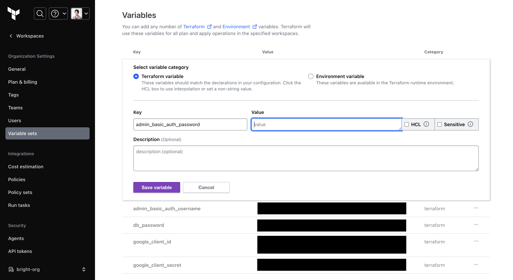
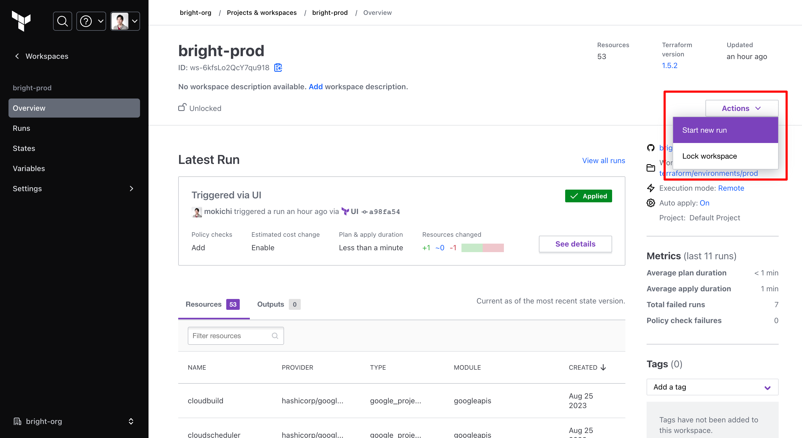

# Bright インフラ構成管理

[インフラ構成](../docs/infrastructure.md)に従って、Terraformを使ってGoogle Cloudの各種リソースを管理する。

## 事前準備

### ツール

asdfで以下のツールをインストールする（バージョンは [.tool-versions](./.tool-versions) を参照）。

- Terraform
- TFLint

### Terraform Cloud

[Terraform Cloud](https://app.terraform.io/public/signup/account?product_intent=terraform)で、秘匿情報の管理とプロビジョニングの実行を管理する。

1. Terraform Cloudのアカウントを（持っていなければ）作成する
2. `terraform login` を実行し、ローカルからTerraform Cloudにアクセスできるようにする
3. Organizationに自分のアカウントを招待してもらう

### Google Cloud

Google Cloudのプロジェクトに自分のGoogleアカウントを招待してもらう。

## ディレクトリ構成

[クラスメソッド社が公開しているベストプラクティス](https://dev.classmethod.jp/articles/terraform-bset-practice-jp/)に従う。

```bash
.
├── environments
│   ├── dev
│   ├── stg
│   └── prod
└── modules
    └── google
        ├── apis                    # 各種APIの有効化
        ├── bucket                  # ユーザーがアップロードしたファイルを保存するGCSバケット
        ├── docker_registry         # Dockerイメージの管理
        ├── cloud_run_batch         # 空のバッチ処理用Cloud Run Job（デプロイはCloud Buildで実行）
        ├── cloud_run_service       # 空のCloud Runサービス（デプロイはCloud Buildで実行）
        ├── db                      # データベース（PostgreSQL）
        ├── managed_service_account # Googleマネージドサービスアカウントへの権限付与
        ├── oidc_github_actions     # GitHub ActionsでGoogle CloudリソースにアクセスできるようにするためのOIDC設定
        ├── secret                  # アプリケーションから参照する秘匿情報
        └── service_account         # ユーザー管理サービスアカウントへの権限付与
```

## 既存環境の変更とプロビジョニング

dev環境を例とする。

1. `environments/dev` 以下のファイルを更新する
2. モジュールが足りなかったり内容が不足している場合、 `modules` 以下のファイルを更新する
3. `terraform plan` を実行し、各種リソースが意図した通りに変更されるか確認する
4. `main` ブランチに反映すると、自動でプロビジョニングされる

**※Cloud Runサービスが再構築されると自動生成のドメイン名が変わるため要注意**

## 秘匿情報の変更と反映

秘匿情報の管理にはTerraform Cloudの [Variable sets](https://app.terraform.io/app/bright-org/settings/varsets) を使用しており、環境ごとに `bright-***` という名前のVariable setを登録している。

秘匿情報を変更（追加や削除も含む）する場合、以下の手順で変更と反映を行う。

1. Terraform Cloud上で、Variable setの内容を変更する
2. Terraform Cloud上で、手動でApplyする
3. Phoenixアプリケーションをデプロイする（アプリに何も変更がなくても必要）

### 例：prod環境のBasic認証のパスワードを変更する

1. Terraform Cloud上で、Variable setの内容を変更する
    
2. Terraform Cloud上で、手動でApplyする
    
3. Phoenixアプリケーションをデプロイする（アプリに何も変更がなくても必要）
    - `prod-` というprefixのGitタグをPushするとデプロイされる
    - [GitHub Releaseを作成](https://github.com/bright-org/bright/releases/tag/release-sample) してデプロイすることも可能
